# IR-1

## 정답

`KEEPER{2023년_10월_회계부.png_2024-01-03T17:18:11_0iajdngxorfo.exe}`

## 풀이 과정

문제로 주어진 이미지 파일을 보면 암호화된 파일들이 보이며, 랜섬웨어에 걸렸음을 확인할 수 있다.

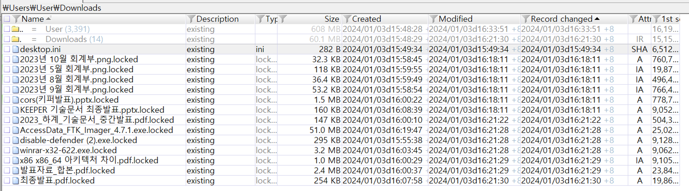

추가로 Record changed 시간이 16시 18분, 16시 21분으로 나눠진 것으로 보아 랜섬웨어가 2번의 감염을 수행한 것으로 확인된다. (또는 단순히 랜섬웨어가 2번에 걸쳐 감염을 수행했을 수도 있다.)

더 확실하게 확인하기 위해선 `$MFT`, `$LogFile`, `$UsnJrnl:J`를 확인하여 디스크에 언제 생성되었고 실행되었는지 확인해야 한다.

NTFS Log Tracker를 사용하여 로그를 추출한 후 csv 파일로 뽑아낸다.

그 다음 `.locked` 확장자를 검색하고 그 주위 로그를 분석하면 된다. 랜섬웨어가 실행됨에 따라 `.locked`로 변한 것이기 때문이다.

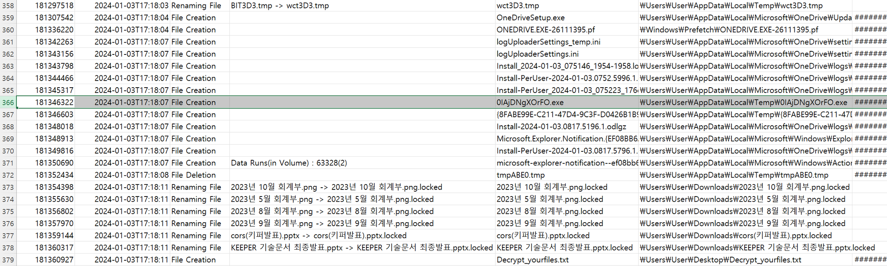

최초로 암호화된 파일은 `2023년 10월 회계부.png`

그 위에 Temp 폴더에 생성된 수상한 파일이 존재한다.

생성 시간(`2024-01-03T17:18:07`)과 암호화된 시간(`2024-01-03T17:18:11`)을 보면 매우 가깝다. 생성됨과 동시에 실행되었음을 추측할 수 있다.

`0IAjDNgXOrFO.exe`인데 도구에 따라서 대문자로만 보여주는 경우도 있으므로 flag 통일을 위해 소문자로 인증 요구

더 나아가서 해당 파일을 추출하고 [virustotal](https://www.virustotal.com/gui/file/f518277b7006b6ffdc8cc3a3ff6943f1fcaffd98078bf529e8ae9183c05ba941)의 결과를 확인하면 `HiddenTear Ransomware`임을 확인할 수 있다.

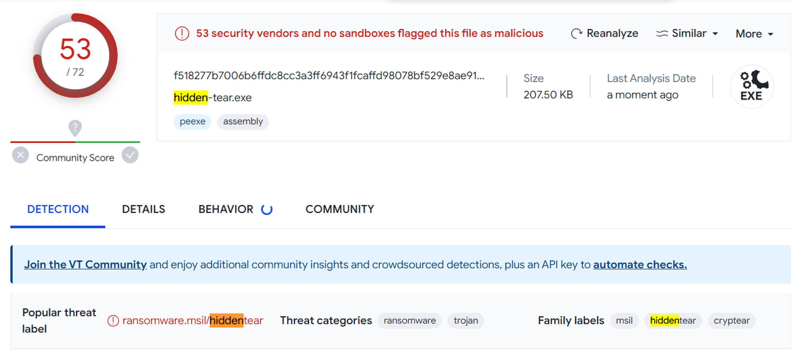

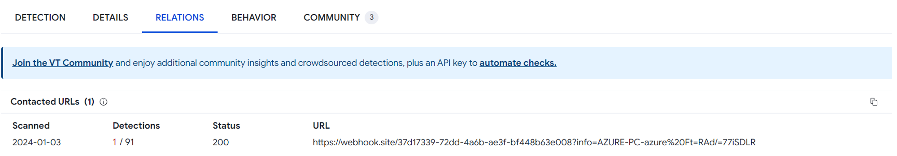

[webbhook.site](https://webhook.site/) 사이트를 통해 사용자 정보 및 decrypt key가 전송됨을 유추할 수 있다.

`.locked` 로 암호화된 파일들을 더 찾아보면 풀이 과정 처음에 말했던 것처럼 2개의 랜섬웨어 파일이 사용되었음을 파일 시스템 로그를 통해 증명할 수 있다.

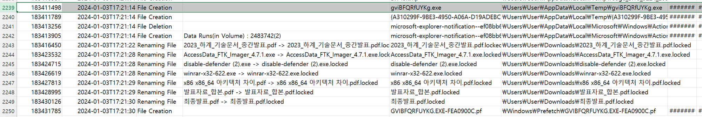

해당 파일도 virustotal에 업로드한 결과 동일한 랜섬웨어임을 확인할 수 있었다.

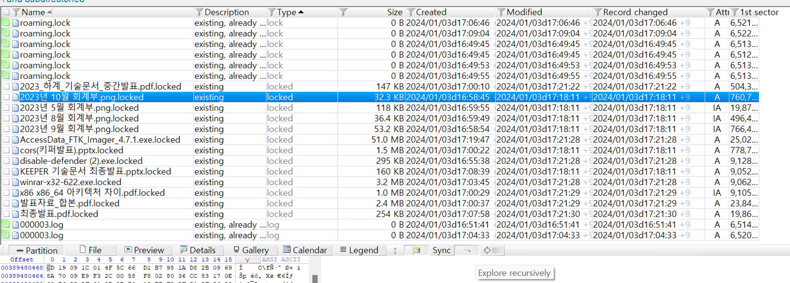

x-ways에서 `Explore recursively` 기능을 사용하면 폴더 내부에 존재하는 파일들을 한 화면에 볼 수 있으며, Type으로 정렬 후 `locked`를 검색하면 위와 같은 결과가 나온다.

이전에 확인된 감염 파일들을 제외하면 추가로 감염된 파일은 없는 것으로 보인다.

# IR-2

## 정답

`KEEPER{https://keeper.or.kr/board/view/172731_11월_회계부.rar_2024-01-03T17:04:29}`

## 풀이 과정

### 브라우저 분석 (Edge)

[hindsight](https://github.com/obsidianforensics/hindsight) 도구 사용하여 브라우저 기록 분석 시작

크롬, 파이어폭스 등 다른 브라우저는 설치 흔적이 없었으므로 Edge 브라우저 분석 시작

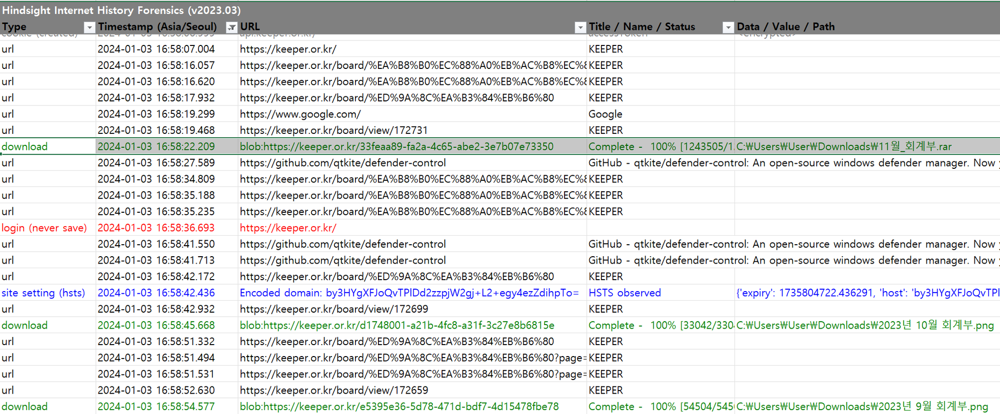

아래 로그를 보면 일반적인 회계부의 경우 png 이미지 파일인데, 11월 회계부는 rar 파일을 다운로드 받음

해당 게시글인  [`https://keeper.or.kr/board/view/172731`](https://keeper.or.kr/board/view/172731에)에 현재는 `11월_회계부.rar` 파일이 존재하지 않음 (사이트 관리자가 롤백했을 수도, 작성자가 다시 수정했을 수도 이후 작업은 E01(이미지) 파일만으로는 확인할 수 없다.)

`11월_회계부.rar` 파일 다운로드 버튼 클릭 시간은 `2024-01-03T16:58:22`

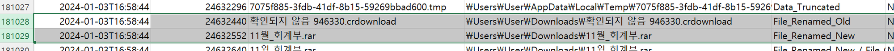

`UsnJrnl` 에서도 다운로드 기록을 확인할 수 있다. `crdownload`는 다운로드 중일 때 생성되는 파일인데 `2024-01-03T16:58:44`에 다운로드가 완료된 것으로 보인다.

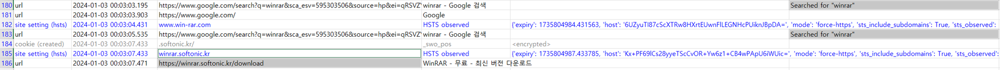

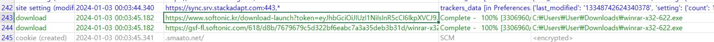

rar 파일을 열기 위해 winrar 검색 후 상단에 뜨는 softsonic 사이트에서 6.22 버전을 다운로드

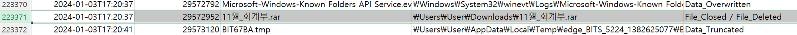

다운로드 받은 `11월_회계부.rar` 파일의 경로에 가면 존재하지 않는데, 이후에 계속 활용하는 파일 시스템 로그를 통해 `2024-01-03T17:20:37`에 삭제된 것을 확인할 수 있다.

### 레지스트리 및 파일 시스템 분석

일단 다운로드 받은 winrar가 설치되었는지 `Amcache.hve`를 통해 확인 가능

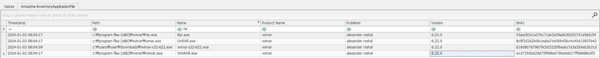

`C:\program files (x86)\winrar` 경로에 6.22 버전이 설치되었음을 확인

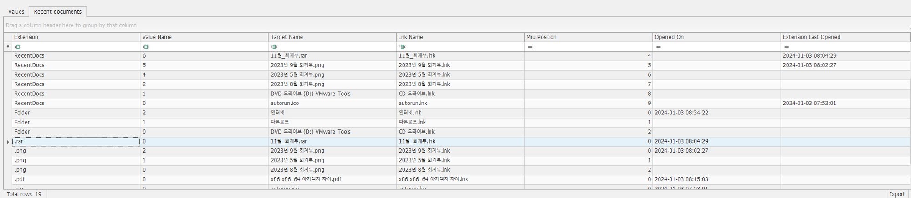

RecentDocs 확인 결과 `2024-01-03 08:04:29` → 9시간 더한 시간인 `2024-01-03 17:04:29` 실행 (바이너리에는 UTC+0으로 저장되어 있기 때문에 도구에서 UTC를 설정하는 기능이 별도로 존재하지 않는 한 UTC+0이라 생각하고 타임스탬프를 계산해야 한다.)

해당 시간을 기점으로 `MFT`, `Usnjrnl` 분석 시작

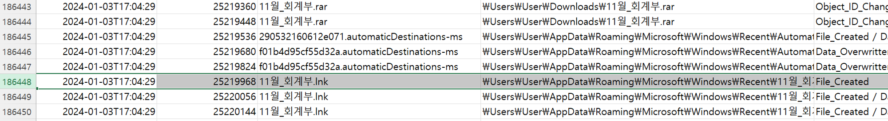

확인한 결과 레지스트리 데이터처럼 `11월_회계부.lnk` 파일이 생성되었고 시간도 맞았음.

lnk 파일이 생성되었다는 것 자체가 해당 파일을 실행하여 생성된 것이기 때문에 rar 파일을 실행한 시간이라고 봐도 무방함 (rar 파일을 받았다고 lnk 파일이 생성되진 않음, 또한 RecentDocs의 Extension Last Opened 시간과 같음을 확인할 수 있음)

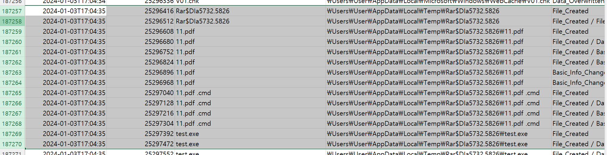

내리다보면 Temp 폴더에 rar 파일을 실행함에 따라 생성된 것으로 보이는데(Temp 폴더 경로를 보면 짐작할 수 있다. - Temp\Rar$~~~) `.cmd` 파일, `test.exe` 등 수상한 파일들이 Temp 폴더에 생성됨

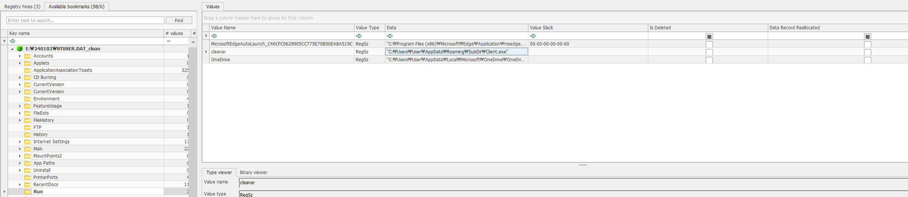

윈도우 부팅 시 자동 실행되는 레지스트리 경로인 Run에 수상한 파일 존재 `C:\Users\User\AppData\Roaming\SubDir\Client.exe`

다행히 해당 파일은 존재함, 컴퓨터가 꺼지더라도 계속 유지할 수 있게 등록되어 있어서 파일이 존재했음

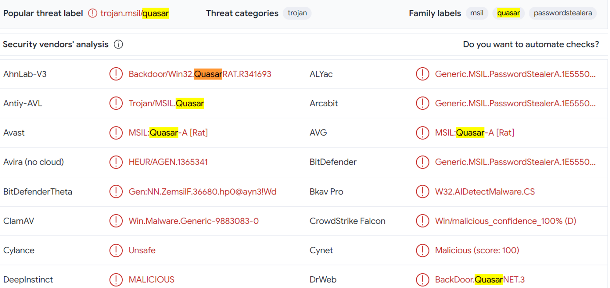

[virustotal](https://www.virustotal.com/gui/file/e1ba9b080a82235dd690788cb6644ce39f3687620854e86b8147a2bf7ce16d26) 결과 Quasar RAT 파일이며, 피해자가 말한 이상한 행위는 좀비PC에 감염되어 이상한 행위를 했을 수 있음. 

랜섬웨어 감염 역시 RAT Builder 배포자가 실행시켰을 가능성도 존재

`test.exe`는 무엇인지, `Client.exe`는 무엇인지 확인이 필요함 → 역시 `MFT`, `UsnJrnl`에서 확인

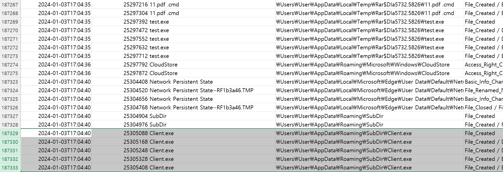

2024-01-03T17:04:35 → 2024-01-03T17:04:40 (`test.exe`, `Client.exe`)

두 파일의 생성 시간이 매우 유사한 것과, `test.exe` 파일이 Temp 경로에 있었다는 것을 기반으로 `test.exe` 파일이 실행되면서 `C:\Users\User\AppData\Roaming\SubDir` 경로에 `Client.exe`라는 파일이 생성된 것으로 추측할 수 있다.

### 결론

지금까지 추출한 타임스탬프를 나열하면 다음과 같다.

2024-01-03T16:58:19 - [`https://keeper.or.kr/board/view/172731`](https://keeper.or.kr/board/view/172731에) 접속

2024-01-03T16:58:22 - `11월_회계부.rar` 파일 다운로드 클릭

2024-01-03T16:58:44 - `11월_회계부.rar` 파일 다운로드 완료

2024-01-03T17:04:29 - `11월_회계부.rar` 파일 실행

2024-01-03T17:04:35 - rar 압축파일 내부에 존재하는 `11.pdf` 실행과 동시에 `11.pdf .cmd`, `test.exe` 파일 생성 (실행되었을 가능성 높음)

2024-01-03T17:04:40 - `Client.exe` 생성 (test.exe 파일에 의해 생성되었다고 추측 가능)

2024-01-03T17:20:37 - `11월_회계부.rar` 파일 삭제 (피해자에게 물어봐서 삭제하지 않았다고 한다면, RAT Builder 배포자가 삭제했거나 지금까지 발견된 악성코드에 의해 삭제되었거나 둘 중 하나임 → 이 부분은 상세한 악성코드 분석 필요)

**IR-1 타임라인**까지 합치면

2024-01-03T17:18:07 - `0IAjDNgXOrFO.exe` 파일 생성

2024-01-03T17:18:11 이후 - `2023년 10월 회계부.png` 등 암호화

2024-01-03T17:21:14 - `gviBFQRfUYKg.exe` 파일 생성

2024-01-03T17:21:22 이후 - `2023_하계_기술문서_중간발표.pdf` 등 암호화

난독화되지 않은 파일이 있는 것을 확인하고 핵심 유입 파일인 rar 파일을 삭제하고 재감염시켰다고 추측할 수도 있음

### 실제 감염 경로

keeper 홈페이지에 올라온 rar 파일을 열어보기 위해 softsonic 사이트에서 winrar 설치 (위 링크를 통해 다운로드 받은 버전은 [cve-2023-38831](https://github.com/b1tg/CVE-2023-38831-winrar-exploit) 취약점이 존재한다.)

rar 파일 내부에 `11.pdf` 파일을 열면서 QuasarRAT 파일이 실행됨 (실제로 `test.exe` 파일이 실행되면서 `client.exe` 파일로 복사되며, 지속성을 유지하기 위해 윈도우가 실행될 때마다 계속 실행되게 레지스트리 등록된다. `test.exe`와 `client.exe`는 같은 파일이다.)

RAT Builder 배포자가 RAT를 통해 2번에 걸쳐 랜섬웨어 배포 (감염되지 않은 확장자가 있어서 코드에 확장자 추가 및 재컴파일 후 배포했다.)

### 관련 자료

cve-2023-38831 취약점 분석 글: [HDCE-inc](https://hdce.medium.com/cve-2023-38831-winrar-zero-day-poses-new-risks-for-traders-684911befad2) [group-ib](https://www.group-ib.com/blog/cve-2023-38831-winrar-zero-day/)

[QuasarRAT - The Best Windows RAT? - Remote Administration Tool for Windows](https://youtu.be/kyueZUfSWO4)

# IR-3

## 정답

`KEEPER{quasar_hiddentear}`

## 풀이 과정

IR-2에 풀이를 자세하게 적어서 IR-2를 참고하면 된다.

IR-2까지 추측성으로 충분히 풀 수 있어서 IR-3에 어떤 파일이 RAT인지 랜섬웨어인지 virustotal에 올려서 확인하는 작업을 통해 악성코드 파악 가능

# IR-4

## 정답

`KEEPER{MessageB0xoxx0xo_0x0xoxxox}`

## 풀이과정

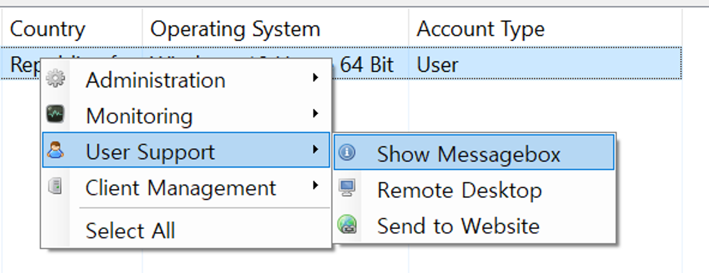

Quasar RAT에서 `Show Messagebox` 기능을 사용했다.

evtx를 보면 MessageBox 뜬 출력 결과를 확인할 수 있다.

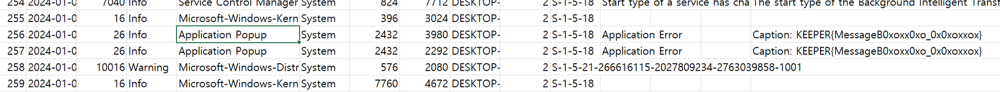
