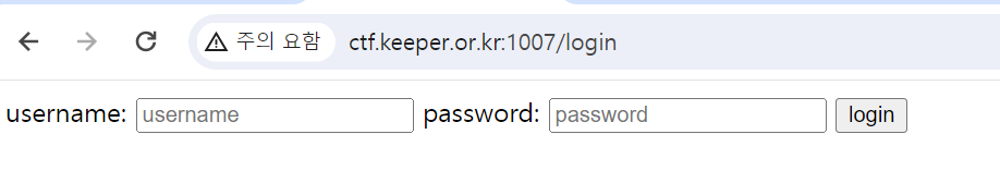
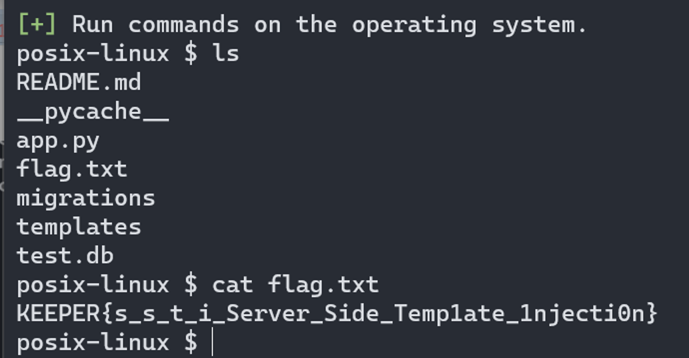

# simple-flask

로그인을 실패했을 때 입력한 유저명과 비밀번호를 출력하는데 render_template_string에 의해 input 값으로 템플릿 언어를 입력했을 때 그대로 계산되어 SSTI 취약점 존재

예를 들어 username 혹은 password에 `{{2 * 2}}` 라고 입력하면 계산된 값인 4가 출력된다. (원하는 코드를 실행할 수 있음)

python jail에서 사용하는 방법으로 원하는 코드를 실행할 수 있는데, [SSTImap](https://github.com/vladko312/SSTImap)을 사용하면 쉽게 풀을 수 있다.

`python [sstimap.py](http://sstimap.py/) -u http://127.0.0.1:5000/login --forms --os-shell`

위와 같은 명령어를 입력하여 아래와 같이 조회 및 flag를 확인할 수 있었다.

