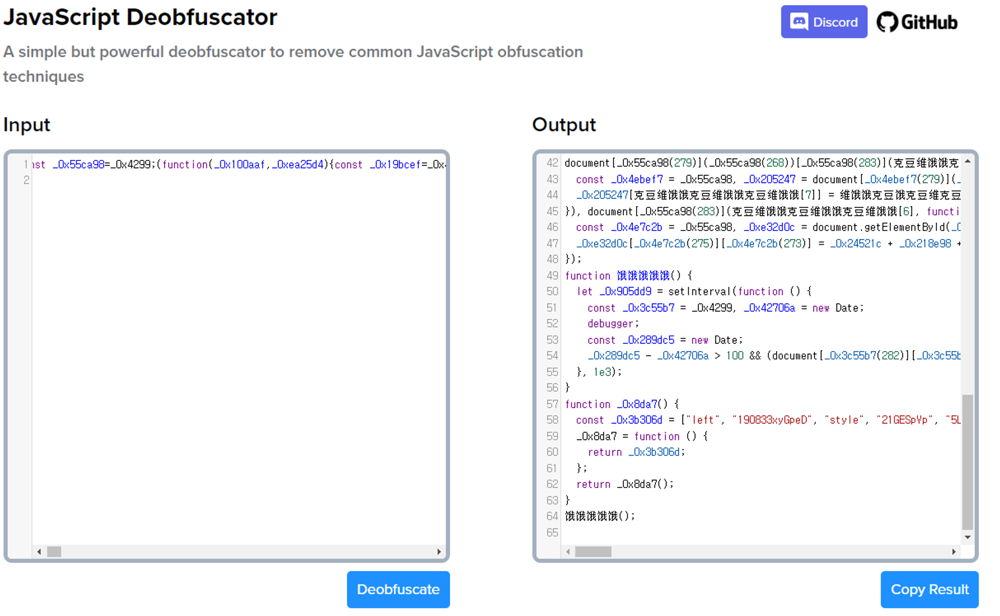
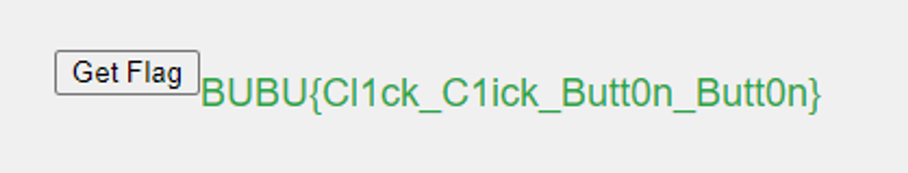
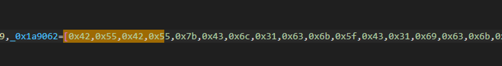

# Button_Click

원본코드

```
<!DOCTYPE html>
<html lang="en">

<head>
    <meta charset="UTF-8">
    <title>Catch the Flag</title>
    <style>
        body {
            font-family: Arial, sans-serif;
            display: flex;
            justify-content: center;
            align-items: center;
            height: 100vh;
            background-color: #f0f0f0;
        }

        .维饿饿克豆饿维克豆 {
            position: absolute;
            padding: 10px 20px;
            font-size: 16px;
            background-color: #007bff;
            color: white;
            border: none;
            cursor: pointer;
            border-radius: 5px;
        }

        .维饿饿克豆饿维克豆:focus {
            outline: none;
        }

        .维饿饿克豆饿克豆维克豆 {
            display: none;
            margin-top: 20px;
            font-size: 18px;
            color: #28a745;
        }
    </style>
</head>

<body>
    <button id="维饿饿克豆饿克豆维克豆克豆" class="维饿饿克豆饿维克豆">Get Flag</button>
    <div id="维饿饿克豆饿克饿克豆维克豆克豆" class="维饿饿克豆饿克豆维克豆"></div>

    <script>
        function getCharCode(豆维克豆维克, 豆维克豆维克豆维克豆维克) {
            return String.fromCharCode(豆维克豆维克 + 豆维克豆维克豆维克豆维克);
        }

        function 豆维克豆克豆维饿饿克(豆) {
            let 克豆饿克豆维克 = '';
            for (let i = 0; i < 豆.length; i++) {
                克豆饿克豆维克 += getCharCode(豆[i], 0);
            }
            return 克豆饿克豆维克;
        }

        const 克豆维饿饿克豆维饿饿克豆维饿饿 = [
            豆维克豆克豆维饿饿克([108, 101, 110, 103, 116, 104]),
            豆维克豆克豆维饿饿克([100, 105, 115, 112, 108, 97, 121]),
            豆维克豆克豆维饿饿克([99, 108, 105, 99, 107]),
            豆维克豆克豆维饿饿克([97, 100, 100, 69, 118, 101, 110, 116, 76, 105, 115, 116, 101, 110, 101, 114]),
            豆维克豆克豆维饿饿克([102, 114, 111, 109, 67, 104, 97, 114, 67, 111, 100, 101]),
            豆维克豆克豆维饿饿克([103, 101, 116, 69, 108, 101, 109, 101, 110, 116, 66, 121, 73, 100]),
            豆维克豆克豆维饿饿克([109, 111, 117, 115, 101, 109, 111, 118, 101]),
            豆维克豆克豆维饿饿克([116, 101, 120, 116, 67, 111, 110, 116, 101, 110, 116]),
            豆维克豆克豆维饿饿克([115, 116, 121, 108, 101]),
            豆维克豆克豆维饿饿克([98, 108, 111, 99, 107])

        ];

        function 维饿饿克豆饿克豆维克豆克豆维饿饿克豆饿克豆维克豆克豆维饿饿克豆饿克豆维克豆克豆() {
            const 克豆维饿饿 = [
                66, 85, 66, 85, 123, 67, 108, 49, 99, 107, 95, 67, 49, 105, 99, 107, 95, 66, 117, 116, 116, 48, 110, 95, 66, 117, 116, 116, 48, 110, 125
            ];
            let 克豆维饿饿克豆维饿饿 = '';
            for (let i = 0; i < 克豆维饿饿.length; i++) {
                克豆维饿饿克豆维饿饿 += String.fromCharCode(克豆维饿饿[i]);
            }
            return 克豆维饿饿克豆维饿饿;
        }

        document.getElementById('维饿饿克豆饿克豆维克豆克豆').addEventListener(克豆维饿饿克豆维饿饿克豆维饿饿[2], function () {
            const 维饿饿克豆饿克饿克豆维克豆克豆 = document.getElementById('维饿饿克豆饿克饿克豆维克豆克豆');
            维饿饿克豆饿克饿克豆维克豆克豆[克豆维饿饿克豆维饿饿克豆维饿饿[7]] = 维饿饿克豆饿克豆维克豆克豆维饿饿克豆饿克豆维克豆克豆维饿饿克豆饿克豆维克豆克豆();
            维饿饿克豆饿克饿克豆维克豆克豆[克豆维饿饿克豆维饿饿克豆维饿饿[8]][克豆维饿饿克豆维饿饿克豆维饿饿[1]] = 克豆维饿饿克豆维饿饿克豆维饿饿[9];
        });

        document.addEventListener(克豆维饿饿克豆维饿饿克豆维饿饿[6], function (event) {
            const 饿饿饿饿饿饿饿饿饿饿 = document.getElementById('维饿饿克豆饿克豆维克豆克豆');
            const 克豆克豆克豆克豆克豆克豆 = event.clientX;
            const 饿克豆饿克豆饿克豆饿克豆饿克豆 = event.clientY;
            const 克豆克豆克豆克 = 45;
            const 克豆维克豆 = 45;

            饿饿饿饿饿饿饿饿饿饿.style.left = (克豆克豆克豆克豆克豆克豆 + 克豆克豆克豆克) + 'px';
            饿饿饿饿饿饿饿饿饿饿.style.top = (饿克豆饿克豆饿克豆饿克豆饿克豆 + 克豆维克豆) + 'px';
        });

        function 饿饿饿饿饿() {
            let 饿饿饿饿 = setInterval(function() {
                const 饿饿饿饿饿饿饿饿饿饿饿饿饿饿饿饿饿饿饿饿饿饿饿饿饿饿饿饿饿饿 = new Date();
                debugger;
                const 饿饿饿饿饿饿饿饿饿饿饿饿饿饿饿饿饿饿饿饿饿饿饿饿饿饿饿饿饿 = new Date();
                if (饿饿饿饿饿饿饿饿饿饿饿饿饿饿饿饿饿饿饿饿饿饿饿饿饿饿饿饿饿 - 饿饿饿饿饿饿饿饿饿饿饿饿饿饿饿饿饿饿饿饿饿饿饿饿饿饿饿饿饿饿 > 100) {
                    document.body.innerHTML = 'Debugger Detected! Access Denied!';
                    clearInterval(饿饿饿饿);
                }
            }, 1000);
        }

        饿饿饿饿饿();
    </script>

</body>

</html>
```

자바스크립트 난독화 코드

```
<!DOCTYPE html>
<html lang="en">

<head>
    <meta charset="UTF-8">
    <title>Catch the Flag</title>
    <style>
        body {
            font-family: Arial, sans-serif;
            display: flex;
            justify-content: center;
            align-items: center;
            height: 100vh;
            background-color: #f0f0f0;
        }

        .维饿饿克豆饿维克豆 {
            position: absolute;
            padding: 10px 20px;
            font-size: 16px;
            background-color: #007bff;
            color: white;
            border: none;
            cursor: pointer;
            border-radius: 5px;
        }

        .维饿饿克豆饿维克豆:focus {
            outline: none;
        }

        .维饿饿克豆饿克豆维克豆 {
            display: none;
            margin-top: 20px;
            font-size: 18px;
            color: #28a745;
        }
    </style>
</head>

<body>
    <button id="维饿饿克豆饿克豆维克豆克豆" class="维饿饿克豆饿维克豆">Get Flag</button>
    <div id="维饿饿克豆饿克饿克豆维克豆克豆" class="维饿饿克豆饿克豆维克豆"></div>

    <script>
        const _0x55ca98=_0x4299;(function(_0x100aaf,_0xea25d4){const _0x19bcef=_0x4299,_0x155cf0=_0x100aaf();while(!![]){try{const _0xa62d6d=parseInt(_0x19bcef(0x10b))/0x1*(-parseInt(_0x19bcef(0x10d))/0x2)+parseInt(_0x19bcef(0x112))/0x3*(parseInt(_0x19bcef(0x118))/0x4)+-parseInt(_0x19bcef(0x115))/0x5*(-parseInt(_0x19bcef(0x105))/0x6)+parseInt(_0x19bcef(0x114))/0x7*(-parseInt(_0x19bcef(0x106))/0x8)+-parseInt(_0x19bcef(0x107))/0x9+-parseInt(_0x19bcef(0x109))/0xa*(parseInt(_0x19bcef(0x10e))/0xb)+parseInt(_0x19bcef(0x104))/0xc;if(_0xa62d6d===_0xea25d4)break;else _0x155cf0['push'](_0x155cf0['shift']());}catch(_0x3017fa){_0x155cf0['push'](_0x155cf0['shift']());}}}(_0x8da7,0xc692c));function getCharCode(_0x1d6d1c,_0x30ab34){const _0x35249b=_0x4299;return String[_0x35249b(0x110)](_0x1d6d1c+_0x30ab34);}function 豆维克豆克豆维饿饿克(_0x2d8366){const _0x2fe7b7=_0x4299;let _0x29df06='';for(let _0x5bfc31=0x0;_0x5bfc31<_0x2d8366[_0x2fe7b7(0x108)];_0x5bfc31++){_0x29df06+=getCharCode(_0x2d8366[_0x5bfc31],0x0);}return _0x29df06;}const 克豆维饿饿克豆维饿饿克豆维饿饿=[豆维克豆克豆维饿饿克([0x6c,0x65,0x6e,0x67,0x74,0x68]),豆维克豆克豆维饿饿克([0x64,0x69,0x73,0x70,0x6c,0x61,0x79]),豆维克豆克豆维饿饿克([0x63,0x6c,0x69,0x63,0x6b]),豆维克豆克豆维饿饿克([0x61,0x64,0x64,0x45,0x76,0x65,0x6e,0x74,0x4c,0x69,0x73,0x74,0x65,0x6e,0x65,0x72]),豆维克豆克豆维饿饿克([0x66,0x72,0x6f,0x6d,0x43,0x68,0x61,0x72,0x43,0x6f,0x64,0x65]),豆维克豆克豆维饿饿克([0x67,0x65,0x74,0x45,0x6c,0x65,0x6d,0x65,0x6e,0x74,0x42,0x79,0x49,0x64]),豆维克豆克豆维饿饿克([0x6d,0x6f,0x75,0x73,0x65,0x6d,0x6f,0x76,0x65]),豆维克豆克豆维饿饿克([0x74,0x65,0x78,0x74,0x43,0x6f,0x6e,0x74,0x65,0x6e,0x74]),豆维克豆克豆维饿饿克([0x73,0x74,0x79,0x6c,0x65]),豆维克豆克豆维饿饿克([0x62,0x6c,0x6f,0x63,0x6b])];function _0x4299(_0x94f81d,_0x387130){const _0x8da75b=_0x8da7();return _0x4299=function(_0x429979,_0x111063){_0x429979=_0x429979-0x104;let _0x2d699c=_0x8da75b[_0x429979];return _0x2d699c;},_0x4299(_0x94f81d,_0x387130);}function 维饿饿克豆饿克豆维克豆克豆维饿饿克豆饿克豆维克豆克豆维饿饿克豆饿克豆维克豆克豆(){const _0x3e8003=_0x4299,_0x1a9062=[0x42,0x55,0x42,0x55,0x7b,0x43,0x6c,0x31,0x63,0x6b,0x5f,0x43,0x31,0x69,0x63,0x6b,0x5f,0x42,0x75,0x74,0x74,0x30,0x6e,0x5f,0x42,0x75,0x74,0x74,0x30,0x6e,0x7d];let _0x286c77='';for(let _0x5789d8=0x0;_0x5789d8<_0x1a9062[_0x3e8003(0x108)];_0x5789d8++){_0x286c77+=String[_0x3e8003(0x110)](_0x1a9062[_0x5789d8]);}return _0x286c77;}document[_0x55ca98(0x117)](_0x55ca98(0x10c))[_0x55ca98(0x11b)](克豆维饿饿克豆维饿饿克豆维饿饿[0x2],function(){const _0x4ebef7=_0x55ca98,_0x205247=document[_0x4ebef7(0x117)](_0x4ebef7(0x11d));_0x205247[克豆维饿饿克豆维饿饿克豆维饿饿[0x7]]=维饿饿克豆饿克豆维克豆克豆维饿饿克豆饿克豆维克豆克豆维饿饿克豆饿克豆维克豆克豆(),_0x205247[克豆维饿饿克豆维饿饿克豆维饿饿[0x8]][克豆维饿饿克豆维饿饿克豆维饿饿[0x1]]=克豆维饿饿克豆维饿饿克豆维饿饿[0x9];}),document[_0x55ca98(0x11b)](克豆维饿饿克豆维饿饿克豆维饿饿[0x6],function(_0x1363be){const _0x4e7c2b=_0x55ca98,_0xe32d0c=document['getElementById'](_0x4e7c2b(0x10c)),_0x24521c=_0x1363be[_0x4e7c2b(0x11c)],_0x10b52a=_0x1363be[_0x4e7c2b(0x119)],_0x218e98=0x2d,_0x4684d2=0x2d;_0xe32d0c[_0x4e7c2b(0x113)][_0x4e7c2b(0x111)]=_0x24521c+_0x218e98+'px',_0xe32d0c[_0x4e7c2b(0x113)][_0x4e7c2b(0x10f)]=_0x10b52a+_0x4684d2+'px';});function 饿饿饿饿饿(){let _0x905dd9=setInterval(function(){const _0x3c55b7=_0x4299,_0x42706a=new Date();debugger;const _0x289dc5=new Date();_0x289dc5-_0x42706a>0x64&&(document[_0x3c55b7(0x11a)][_0x3c55b7(0x116)]=_0x3c55b7(0x10a),clearInterval(_0x905dd9));},0x3e8);}function _0x8da7(){const _0x3b306d=['left','190833xyGpeD','style','21GESpVp','5LYtTEV','innerHTML','getElementById','48qBMlmv','clientY','body','addEventListener','clientX','维饿饿克豆饿克饿克豆维克豆克豆','30748764FgETDQ','538662vYJAms','603080QnRBuU','7215282RzGluK','length','14692490DnzjsQ','Debugger\x20Detected!\x20Access\x20Denied!','4TlsGxd','维饿饿克豆饿克豆维克豆克豆','52524mceWPk','11oPPtUI','top','fromCharCode'];_0x8da7=function(){return _0x3b306d;};return _0x8da7();}饿饿饿饿饿();
    </script>

</body>

</html>
```

https://deobfuscate.io/ 에서 어느정도 복호화 가능



디버거 모드를 키면 `debugger;`에 걸리는데 `debugger;`를 지우고 열어서 버튼 돌아다니는 JS 코드 동작 안되게 하면 된다.





위 사진에 있는 값들 문자로 뽑아도 나온다.
