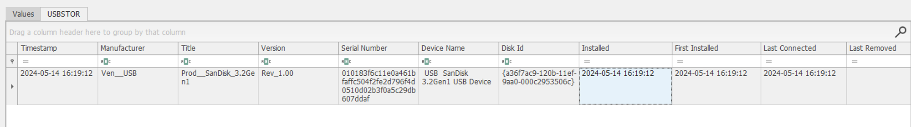
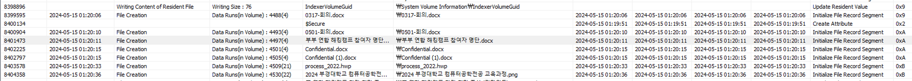
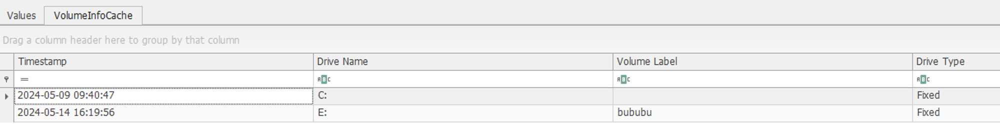

# Data_Leakage

## 정답

`BUBU{2024-05-15T01:19:11_2024-05-15T01:20:11_bububu}`

`BUBU{2024-05-15T01:19:12_2024-05-15T01:20:11_bububu}`

## 풀이 과정

`2024-05-14 16:19:12`에 9시간 더하면 된다. - UTC+0 기준으로 파싱해서 보여주기 때문이다.

파일 이동한 시간은 USB에 존재하는 `$LogFile`, `$MFT` 파일을 분석하면 된다.

`BUBU{2024-05-15T01:19:12_2024-05-15T01:20:11_bububu}`

`setupapi.dev.log`를 분석하면 `2024-05-15T01:19:11` 이 찍혀있는데,

레지스트리 시간보다 1초 일찍 찍혀있는 것을 확인할 수 있다.
→ 정확한 최초 연결 시간은 `2024-05-15T01:19:11`이 맞다.

1초 차이가 존재하기 때문에 두 시간 모두 답으로 설정했다.

## 문제 힌트

USB가 최초로 연결된 시간은 `setupapi.dev.log` 파일에서 `Device install (hardware initiated)` 검색하거나 `C:\Windows\System32\Config\SYSTEM` 레지스트리 파일을 분석하여 `USBSTOR`을 확인하시면 됩니다. 레지스트리 분석 도구는 REGA, Eric Zimmerman이 만든 Registry Explorer 등이 있습니다.

USB에 파일이 이동한 시간은 `$MFT`, `$LogFile` 파일을 추출하여 NTFS Log Tracker를 통해 찾을 수 있습니다. 

USB 드라이브 이름은 `C:\Windows\System32\Config\SOFTWARE` 레지스트리 파일을 분석하여 `VolumeInfoCache`를 확인하시면 됩니다.
