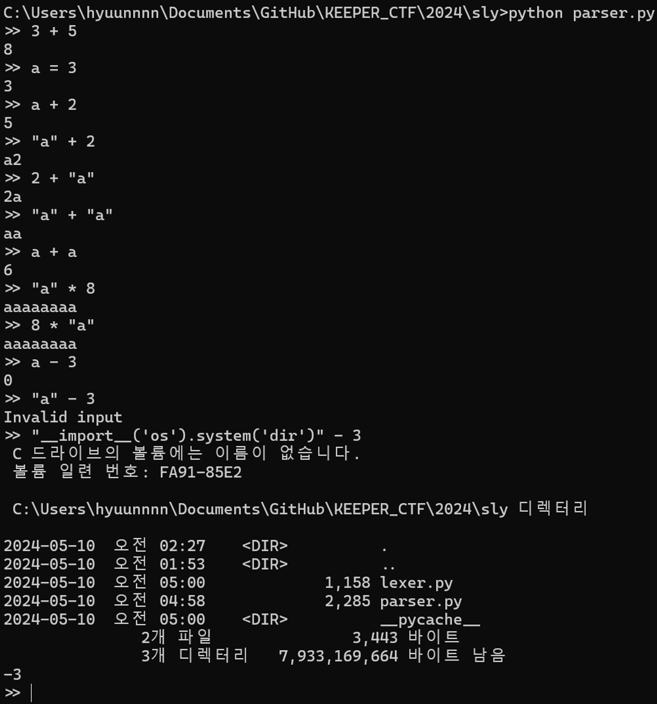
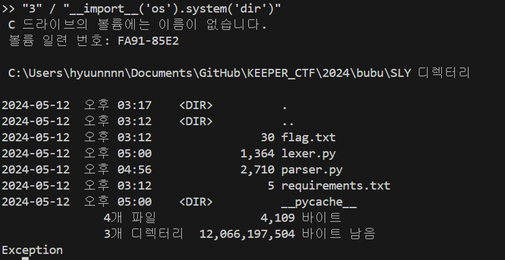
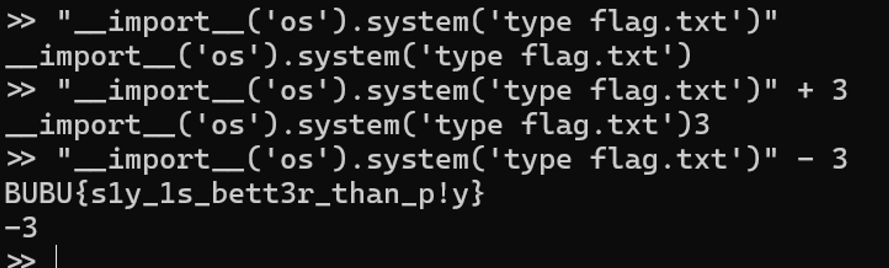

# SLY

`+,-,*,/, 비교 연산` 등을 eval 사용하여 한 번에 처리하는 코드가 있다.

`+, *`는 `eval`을 사용하지 않고 계산 결과를 반환하는데, `-, /`을 사용했을 때 `eval`로 계산되어 파이썬 코드를 사용할 수 있다.

코드 실행 중에 문제가 생겼을 때 Exception 처리가 된다고 생각할 수 있지만, eval에 있는 코드는 우선적으로 해석되어 실행되기 때문에 위와 같이 python jail이 가능하다.

python jail 활용해서 cat flag 해주면 된다. - 위 사진은 윈도우 환경에서 flag를 보기 위해 `type` 명령어 사용
